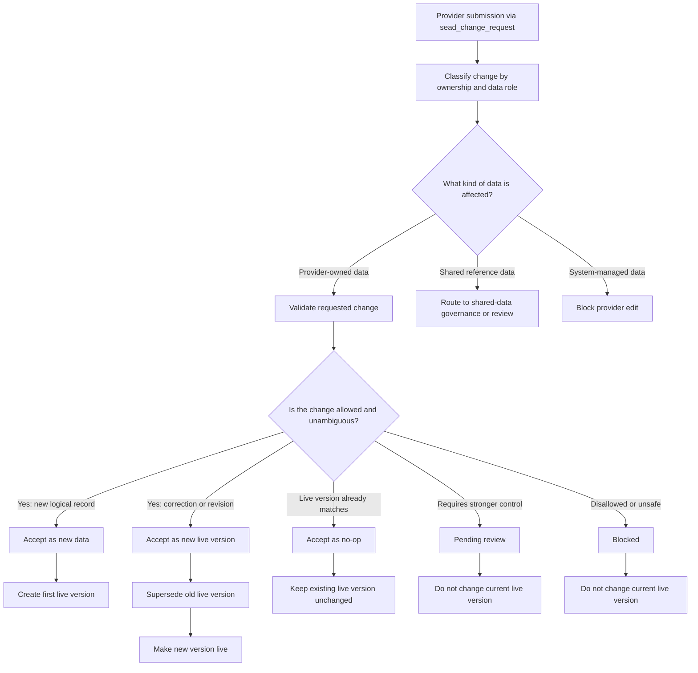
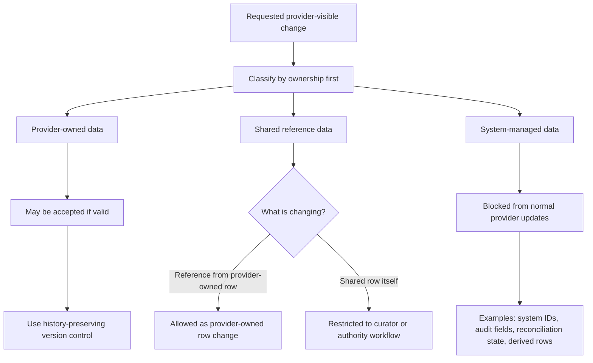
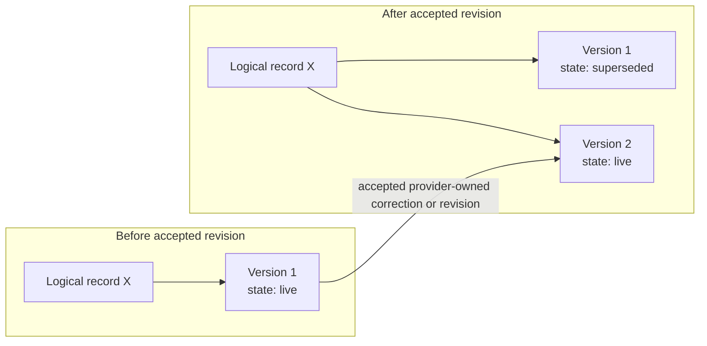
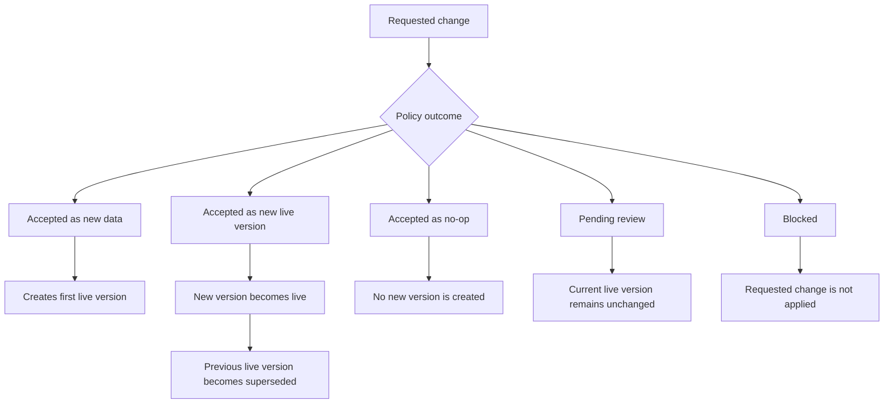
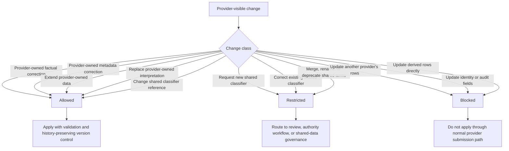
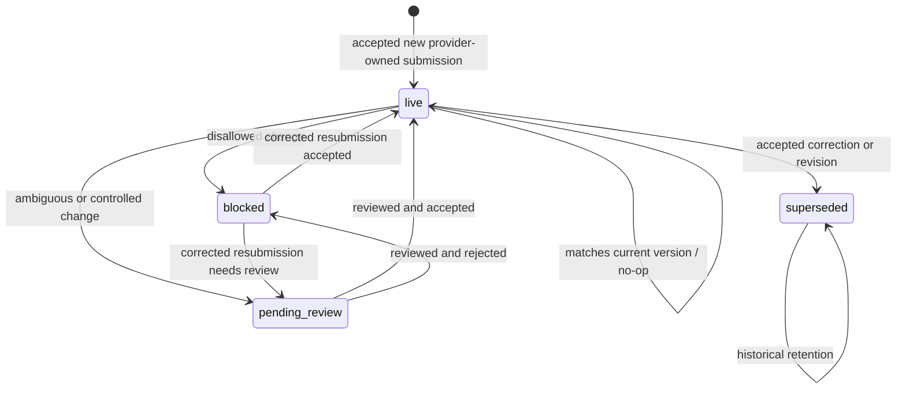
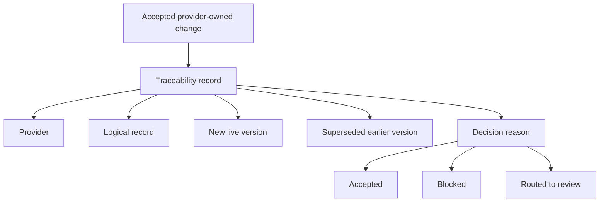

# Data Provider Submission Lifecycle

## Status

- Active durable reference
- Promoted from proposal baseline on 2026-06-30
- Source decision: [proposals/CHANGE_REQUEST_INGESTER/DATA_PROVIDER_UPDATE_SCOPING_CR.md](proposals/CHANGE_REQUEST_INGESTER/DATA_PROVIDER_UPDATE_SCOPING_CR.md)
- Source baseline record: [proposals/CHANGE_REQUEST_INGESTER/DATA_PROVIDER_SUBMISSION_LIFECYCLE_SPECIFICATION.md](proposals/CHANGE_REQUEST_INGESTER/DATA_PROVIDER_SUBMISSION_LIFECYCLE_SPECIFICATION.md)

## Purpose

This document defines lifecycle rules for provider-submitted data that changes over time through `sead_change_request`.

It is the durable rules reference and replaces proposal-era status as the primary source for lifecycle policy.

## Scope

This document covers:

- lifecycle terms for provider submissions and record versions
- ownership rules for provider-owned data, shared reference data, and system-managed data
- invariants for history, supersession, and live-version status
- allowed, restricted, and blocked classes of provider-visible change
- policy-level outcomes of submission processing

## Non-Goals

- defining SQL artifact format
- defining frontend screens or operator UX in detail
- defining delivery phases, milestones, or implementation checklists
- replacing curator or authority workflows for shared-data governance
- defining rollback mechanics in this document

## Core Terms

### Provider submission

A provider submission is a request to add, correct, extend, revise, or supersede data through the `sead_change_request` ingester.

### Logical record

A logical record is the business-level record whose identity stays stable across versions. Different versions of the same logical record describe the same underlying record at different stages of correction or revision.

### Record version

A record version is one stored form of a logical record.

### Live version

The live version is the single accepted version of a logical record that is active for use at a given point in time.

### Superseded version

A superseded version is an older accepted version that remains in history after a newer version becomes live.

### Provider-owned data

Provider-owned data is data for which the submitting provider is the responsible source, such as facts, observations, notes, project-scoped metadata, and similar rows.

### Shared reference data

Shared reference data is reused across providers or projects, such as classifiers, lookups, and controlled vocabularies.

### System-managed data

System-managed data is data controlled by the repository workflow rather than by provider edits, such as identifiers, audit fields, reconciliation state, and derived rows.

## Lifecycle Overview

## Lifecycle Rules

### 1. Ownership comes first

Every provider-visible change must first be classified by ownership and data role.

The repository must distinguish at least:

- provider-owned data
- shared reference data
- system-managed data

No change decision should start from SQL shape alone.

### 2. History must be preserved

Provider-owned corrections and revisions must preserve reviewable history.

The repository must not rely on silent destructive overwrite as the default way to represent accepted provider changes.

### 3. Only one live version may exist

For the same logical record at the same point in time, the repository must keep no more than one live version.

When a newer accepted version replaces the current one, the newer version becomes live and the older accepted version becomes superseded.

### 4. Reference changes are not shared-row changes

Changing which shared term a provider-owned row points to is different from changing the shared term itself.

The first is a possible provider-owned update. The second is a shared-data governance action.

### 5. Shared data does not use the default provider update path

Providers may need to reference shared data, request new shared terms, or report problems in existing shared terms.

They must not directly mutate already-shared rows through the default provider update path.

### 6. System-managed values are not provider-editable

Providers must not directly edit system IDs, target IDs, audit fields, reconciliation state, or derived rows through normal submission updates.

### 7. Ambiguous changes must not be applied silently

If the repository cannot determine whether a change is allowed, material, or conflicting, the change must be blocked or routed to review rather than applied speculatively.

## Submission Outcomes

At the policy level, submission processing should end in one of these outcomes for each requested change:

- accepted as new data
- accepted as a new live version of an existing logical record
- accepted as a no-op because the live version already matches the requested state
- pending review because the change requires stronger control
- blocked because the change is not allowed or cannot be decided safely

## Allowed, Restricted, And Blocked Change Classes

| Change class                                                              | Result                                                            |
|---------------------------------------------------------------------------|-------------------------------------------------------------------|
| Correct provider-owned factual data                                       | Allowed with history-preserving version control                   |
| Correct provider-owned descriptive metadata                               | Allowed with history-preserving version control                   |
| Extend provider-owned data                                                | Allowed when ownership and validation rules are satisfied         |
| Replace an earlier provider-owned interpretation                          | Allowed as tracked supersession, not silent overwrite             |
| Change a provider-owned row so it points to a different shared classifier | Allowed as a change to the provider-owned row, not the shared row |
| Request a new shared classifier or lookup                                 | Restricted to reviewed add path or separate authority workflow    |
| Correct an existing shared classifier or lookup                           | Restricted to curator or authority review                         |
| Merge, rename, or deprecate shared terms                                  | Restricted to dedicated shared-data governance workflow           |
| Update another provider's rows                                            | Blocked                                                           |
| Update identity or audit fields directly                                  | Blocked                                                           |
| Update derived rows directly                                              | Blocked or redirected to the owning source rows                   |

## Minimum State Model

This document expects at least the following record-version states:

- live
- superseded
- pending review
- blocked

Additional implementation states may exist, but they must not weaken the core lifecycle rules in this document.

## Minimum State Transitions

The lifecycle must support at least the following state transitions.

| Starting point | Trigger | Result | Required rule |
|----------------|---------|--------|---------------|
| no existing logical record | accepted new provider-owned submission | live | the accepted version becomes the first live version |
| live | accepted provider-owned correction or revision | superseded for the old version, live for the new version | only one live version may remain after the change |
| live | submission matches current live version | live | treat as no-op; do not create a second live version |
| live | ambiguous or disallowed requested change | blocked or pending review | do not change the current live version |
| pending review | reviewed and accepted provider-owned change | live, with previous live version superseded if one exists | acceptance must preserve the one-live-version invariant |
| pending review | reviewed and rejected change | blocked | the requested change does not become live |
| blocked | corrected resubmission that passes checks | pending review or live | follow the normal acceptance path; blocked status does not grant a shortcut |
| superseded | historical retention | superseded | superseded versions remain available as history and do not become live again without a new accepted change |

These transitions are a minimum policy contract. Implementation documents may add finer-grained workflow states, but they must preserve the outcomes and invariants defined here.

## Traceability Requirements

The repository should retain enough metadata to answer these questions for each accepted provider-owned change:

- which provider submitted the change
- which logical record was affected
- which version became live
- which earlier version was superseded, if any
- why the change was accepted, blocked, or routed to review

## Related Documents

- [proposals/CHANGE_REQUEST_INGESTER/DATA_PROVIDER_UPDATE_SCOPING_CR.md](proposals/CHANGE_REQUEST_INGESTER/DATA_PROVIDER_UPDATE_SCOPING_CR.md) defines the decision about provider-visible change scope
- [proposals/CHANGE_REQUEST_INGESTER/DATA_PROVIDER_SUBMISSION_LIFECYCLE_IMPLEMENTATION_PLAN.md](proposals/CHANGE_REQUEST_INGESTER/DATA_PROVIDER_SUBMISSION_LIFECYCLE_IMPLEMENTATION_PLAN.md) defines phased delivery and phase entry status
- [proposals/CHANGE_REQUEST_INGESTER/UPDATE_HANDLING_FOR_EXISTING_ROWS.md](proposals/CHANGE_REQUEST_INGESTER/UPDATE_HANDLING_FOR_EXISTING_ROWS.md) narrows one follow-up scenario for existing-row update handling
- [proposals/CHANGE_REQUEST_INGESTER/DATA_PROVIDER_SUBMISSION_LIFECYCLE_SPECIFICATION.md](proposals/CHANGE_REQUEST_INGESTER/DATA_PROVIDER_SUBMISSION_LIFECYCLE_SPECIFICATION.md) is retained as the proposal-era baseline record
