# Shape Shifter - System Diagrams

Diagrams showing Shape Shifter's architecture, workflow, and capabilities.

---

## 1. The Problem: Data Integration Chaos

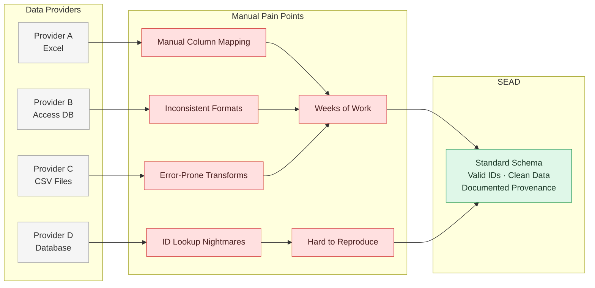

---

## 2. The Solution: Shape Shifter Integration Platform

```mermaid
flowchart LR
    subgraph "Data Sources"
        DS1[Provider A<br/>Excel]
        DS2[Provider B<br/>Access DB]
        DS3[Provider C<br/>CSV Files]
        DS4[Provider D<br/>Database]
    end

    subgraph "Shape Shifter Platform"
        direction TB
        SS1[Configure Once<br/>Declarative YAML]
        SS2[Automatic Validation<br/>Multi-Level Checks]
        SS3[Identity Reconciliation<br/>Auto-Match + Review]
        SS4[Transformation Engine<br/>Reproducible Pipeline]
        SS5[Preview and Verify<br/>Before Commit]
    end

    subgraph "SEAD"
        SEAD[Validated Data<br/>Resolved IDs<br/>Documented Lineage<br/>Ready to Import]
    end

    DS1 --> SS1
    DS2 --> SS1
    DS3 --> SS1
    DS4 --> SS1

    SS1 --> SS2
    SS2 --> SS3
    SS3 --> SS4
    SS4 --> SS5
    SS5 --> SEAD

    classDef source fill:#f5f5f5,stroke:#aaa,color:#333;
    classDef platform fill:#e8f4fd,stroke:#4a90d9,color:#1a3a5c;
    classDef goal fill:#dff7e8,stroke:#2e9f5b,color:#1d3a29;

    class DS1,DS2,DS3,DS4 source;
    class SS1,SS2,SS3,SS4,SS5 platform;
    class SEAD goal;
```

---

## 3. Complete User Workflow

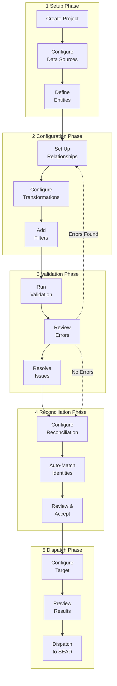

---

## 4. System Architecture

```mermaid
flowchart TB
    subgraph "Frontend Layer (Vue 3 + Vuetify)"
        UI1[Projects View]
        UI2[Entity Manager]
        UI3[Dependency Graph<br/>Cytoscape.js]
        UI4[Validation Panel]
        UI5[Reconciliation Editor]
        UI6[Dispatch Console]
        UI7[YAML Editor<br/>Monaco]
    end
    
    subgraph "State Management (Pinia)"
        ST1[Project Store]
        ST2[Entity Store]
        ST3[Validation Store]
        ST4[Data Source Store]
        ST5[Ingester Store]
    end
    
    subgraph "Backend Services (FastAPI)"
        SVC1[Project Service]
        SVC2[Validation Service]
        SVC3[ShapeShift Service<br/>3-Tier Cache]
        SVC4[Reconciliation Service]
        SVC5[Ingester Registry]
        SVC6[Schema Service]
    end
    
    subgraph "Core Engine (Python)"
        CORE1[Configuration Loader]
        CORE2[Data Loaders]
        CORE3[Constraint Validators]
        CORE4[Transformation Pipeline]
        CORE5[Dispatchers]
    end
    
    subgraph "External Systems"
        EXT1[Data Sources<br/>PostgreSQL, Access, CSV]
        EXT2[Reconciliation Services<br/>OpenRefine Protocol]
        EXT3[Target Systems<br/>SEAD Clearinghouse]
    end
    
    UI1 --> ST1
    UI2 --> ST2
    UI3 --> ST2
    UI4 --> ST3
    UI5 --> ST2
    UI6 --> ST5
    UI7 --> ST1
    
    ST1 --> SVC1
    ST2 --> SVC2
    ST3 --> SVC2
    ST4 --> SVC6
    ST5 --> SVC5
    
    SVC1 --> CORE1
    SVC2 --> CORE3
    SVC3 --> CORE4
    SVC4 --> EXT2
    SVC5 --> CORE5
    SVC6 --> CORE2
    
    CORE2 --> EXT1
    CORE4 --> EXT1
    CORE5 --> EXT3

    classDef graph fill:#e8f4fd,stroke:#4a90d9,color:#1a3a5c;
    classDef cache fill:#fdf3e8,stroke:#d48a2a,color:#4a2800;
    classDef pipeline fill:#f5e8fd,stroke:#8a4ab0,color:#3a1060;

    class UI3 graph;
    class SVC3 cache;
    class CORE4 pipeline;
```

---

## 5. Tabbed Project Interface

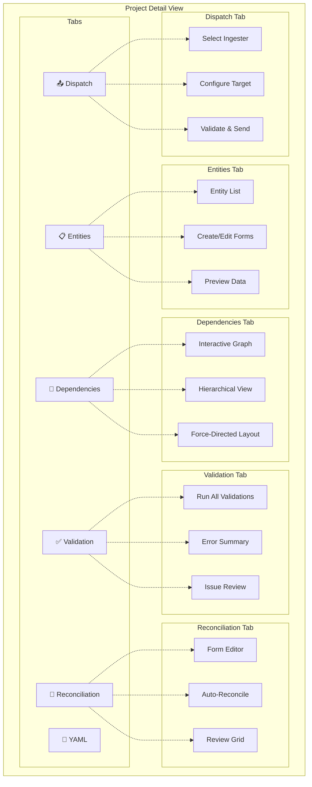

---

## 6. Data Transformation Pipeline

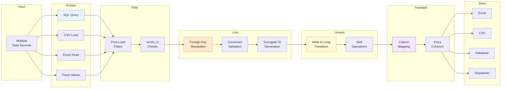

---

## 7. Reconciliation Workflow

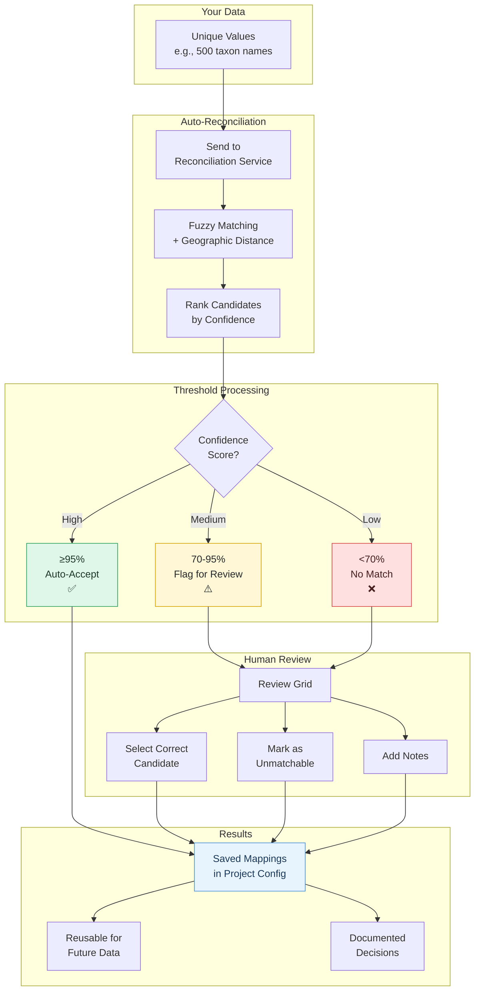

---

## 8. Validation System Architecture

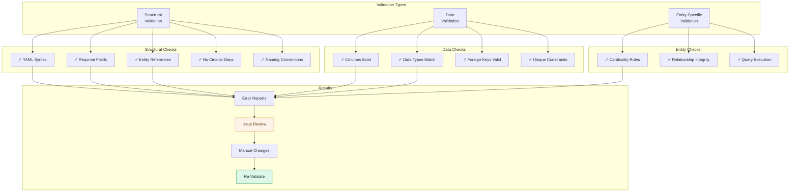

---

## 9. Caching Strategy (ShapeShift Service)

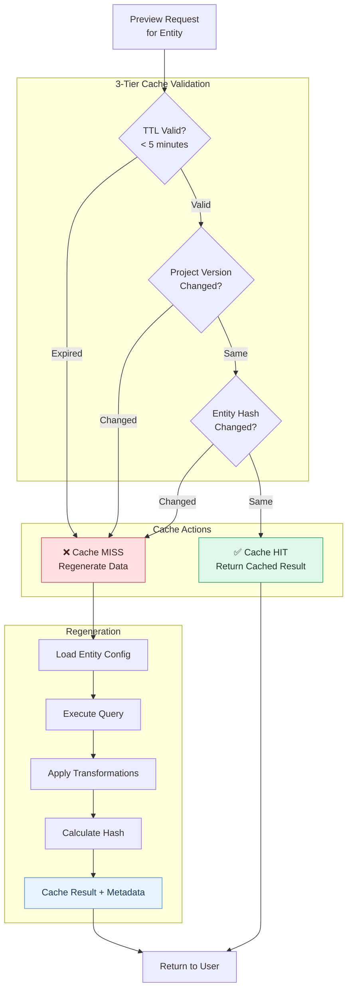

---

## 10. Time Savings Comparison

```mermaid
gantt
    title Traditional vs Shape Shifter Data Integration Timeline
    dateFormat X
    axisFormat %H hours
    
    section Traditional Manual Process
    Export & Transform     :t1, 0, 24h
    Manual ID Lookups      :t2, after t1, 8h
    Error Correction       :t3, after t2, 8h
    QA & Validation        :t4, after t3, 8h
    
    section Shape Shifter (First Time)
    Configure Project      :s1, 0, 2h
    Run Reconciliation     :s2, after s1, 1h
    Execute & Validate     :s3, after s2, 5min
    
    section Shape Shifter (Repeat)
    Update & Re-Dispatch   :r1, 0, 15min
```

**Traditional:** ~48 hours per dataset  
**Shape Shifter (First Time):** ~3.5 hours  
**Shape Shifter (Repeat):** ~15 minutes  

---

## 11. Key Features Overview

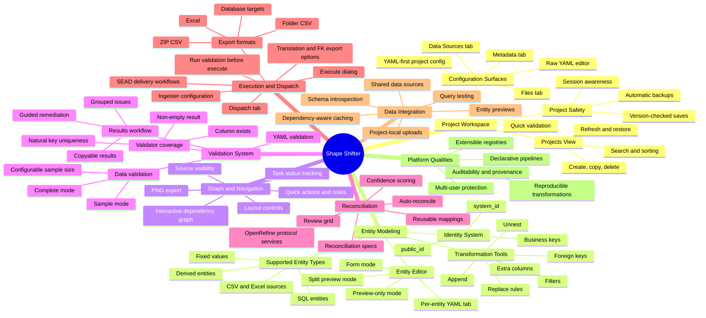

---

## 12. Use Case Feature Map

```mermaid
flowchart TB
    GOAL[User Goals in Shape Shifter]

    GOAL --> MP
    GOAL --> CPS
    GOAL --> EE
    GOAL --> ED
    GOAL --> VCD
    GOAL --> RV
    GOAL --> EXD

    subgraph ManageProjects[Manage Projects]
        direction TB
        MP[Project lifecycle]
        MP1[Create project]
        MP2[Open, copy, delete project]
        MP3[Save changes]
        MP4[Refresh project]
        MP5[Restore backup]
        MP6[Review session status]
        MP --> MP1
        MP --> MP2
        MP --> MP3
        MP --> MP4
        MP --> MP5
        MP --> MP6
    end

    subgraph ConfigureProjectStructure[Configure Project Structure]
        direction TB
        CPS[Project setup]
        CPS1[Edit project YAML]
        CPS2[Edit metadata]
        CPS3[Upload project files]
        CPS4[Connect shared data sources]
        CPS5[Create entity from source table]
        CPS --> CPS1
        CPS --> CPS2
        CPS --> CPS3
        CPS --> CPS4
        CPS4 --> CPS5
    end

    subgraph EditEntity[Edit Entity]
        direction TB
        EE[Entity editing]
        EE1[Define entity type]
        EE2[Configure source entity or data source]
        EE3[Select file, sheet, range, delimiter]
        EE4[Define identity fields]
        EE5[Specify transformations]
        EE6[Edit raw entity YAML]
        EE7[Preview entity output]
        EE --> EE1
        EE --> EE2
        EE --> EE3
        EE --> EE4
        EE --> EE5
        EE --> EE6
        EE --> EE7

        EE4 --> EE41[Set business keys]
        EE4 --> EE42[Set public_id]
        EE4 --> EE43[Keep system_id managed]

        EE5 --> EE51[Specify foreign keys]
        EE5 --> EE52[Specify filters]
        EE5 --> EE53[Specify Unnest]
        EE5 --> EE54[Specify append]
        EE5 --> EE55[Specify extra columns]
        EE5 --> EE56[Specify replace rules]
    end

    subgraph ExploreDependencies[Explore Dependencies]
        direction TB
        ED[Dependency exploration]
        ED1[View graph layout]
        ED2[Inspect source visibility]
        ED3[Review task status]
        ED4[Open notes and quick actions]
        ED5[Export graph image]
        ED --> ED1
        ED --> ED2
        ED --> ED3
        ED --> ED4
        ED --> ED5
    end

    subgraph ValidateConfigurationAndData[Validate Configuration and Data]
        direction TB
        VCD[Validation workflow]
        VCD1[Run YAML validation]
        VCD2[Run sample data validation]
        VCD3[Run complete data validation]
        VCD4[Tune sample size]
        VCD5[Review grouped issues]
        VCD6[Copy validation results]
        VCD --> VCD1
        VCD --> VCD2
        VCD --> VCD3
        VCD --> VCD4
        VCD --> VCD5
        VCD --> VCD6
    end

    subgraph ReconcileValues[Reconcile Values]
        direction TB
        RV[Reconciliation workflow]
        RV1[Configure reconciliation]
        RV2[Edit reconciliation YAML]
        RV3[Run auto-reconcile]
        RV4[Review confidence-ranked matches]
        RV5[Accept, adjust, or reject mappings]
        RV6[Save reusable mappings]
        RV --> RV1
        RV --> RV2
        RV --> RV3
        RV --> RV4
        RV --> RV5
        RV --> RV6
    end

    subgraph ExecuteAndDispatch[Execute and Dispatch]
        direction TB
        EXD[Delivery workflow]
        EXD1[Select output format]
        EXD2[Set file, folder, or database target]
        EXD3[Run validation before execute]
        EXD4[Apply translations]
        EXD5[Drop foreign key columns]
        EXD6[Download result file]
        EXD7[Dispatch via ingester config]
        EXD8[Deliver to SEAD workflow]
        EXD --> EXD1
        EXD --> EXD2
        EXD --> EXD3
        EXD --> EXD4
        EXD --> EXD5
        EXD --> EXD6
        EXD --> EXD7
        EXD --> EXD8
    end
```

---

## 13. User Personas & Use Cases

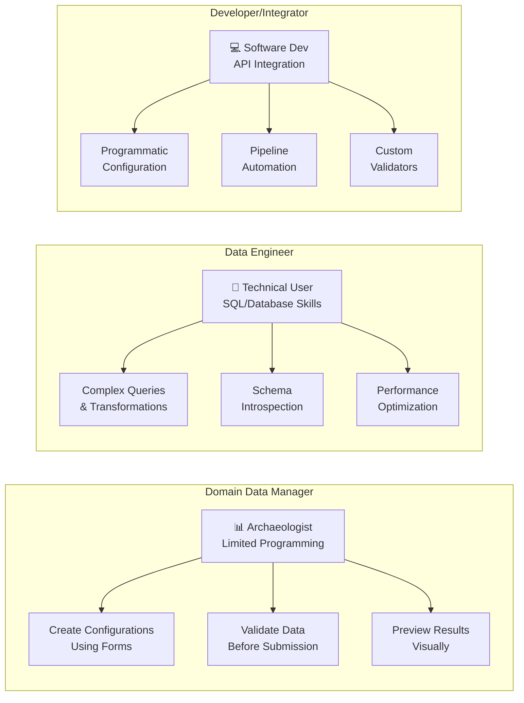
---

## 14. Component Architecture

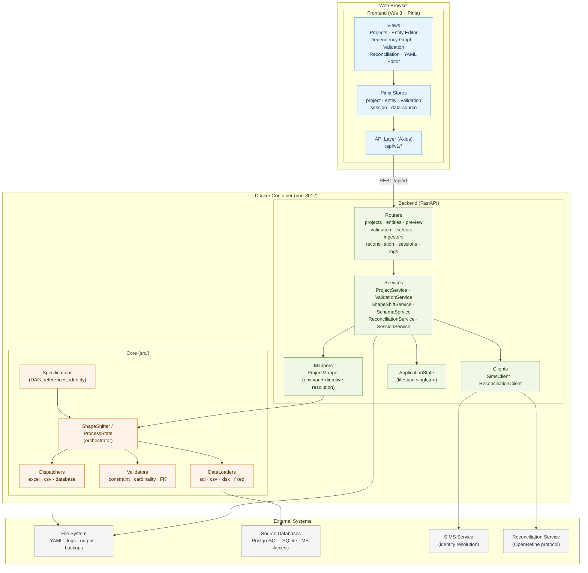

---

## 15. Project Load – Sequence

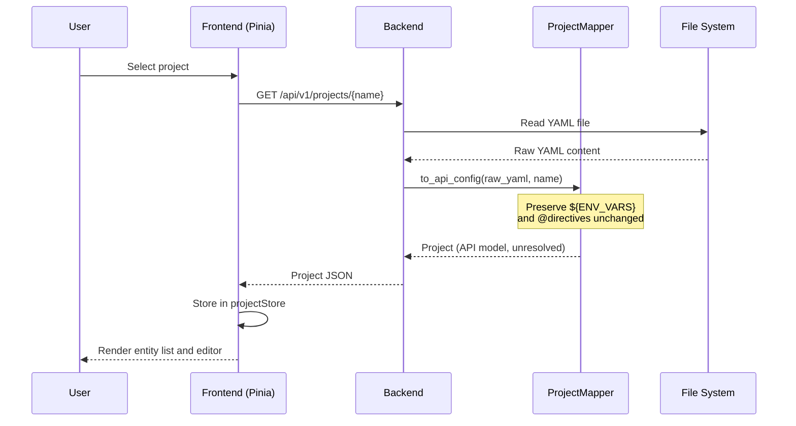

---

## 16. Entity Preview – Sequence

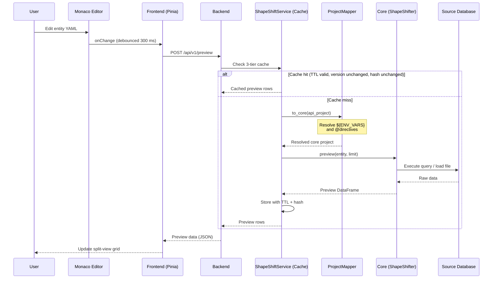

---

## 17. Validation – Sequence

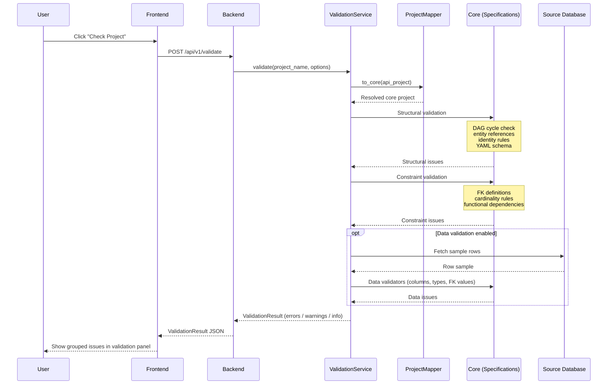

---

## 18. Execution – Sequence

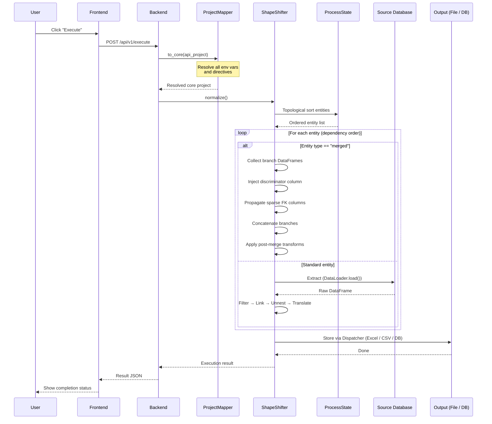

---

## 19. Project Save – Sequence

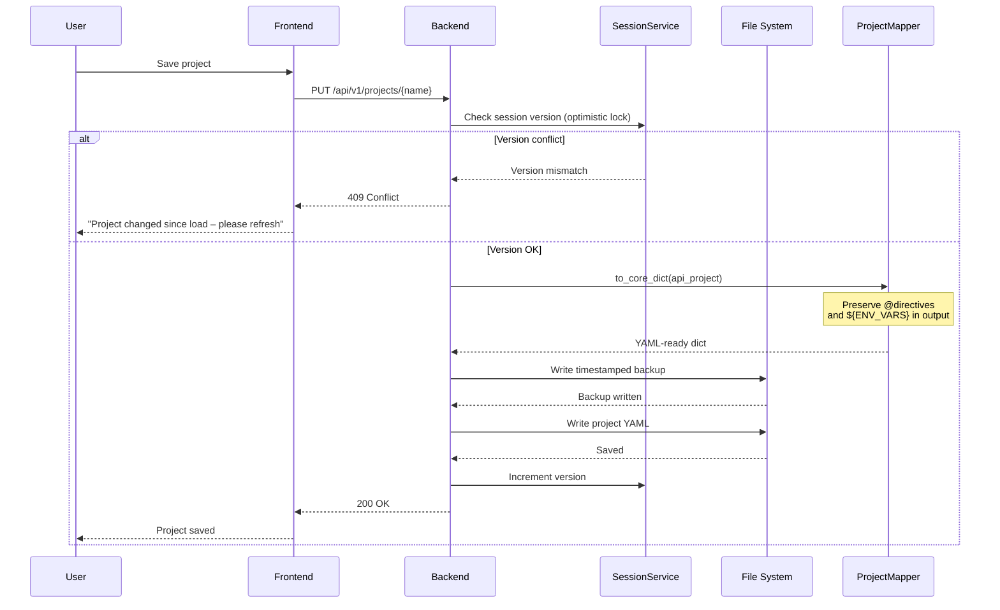

---

## 20. Project Refresh – Sequence

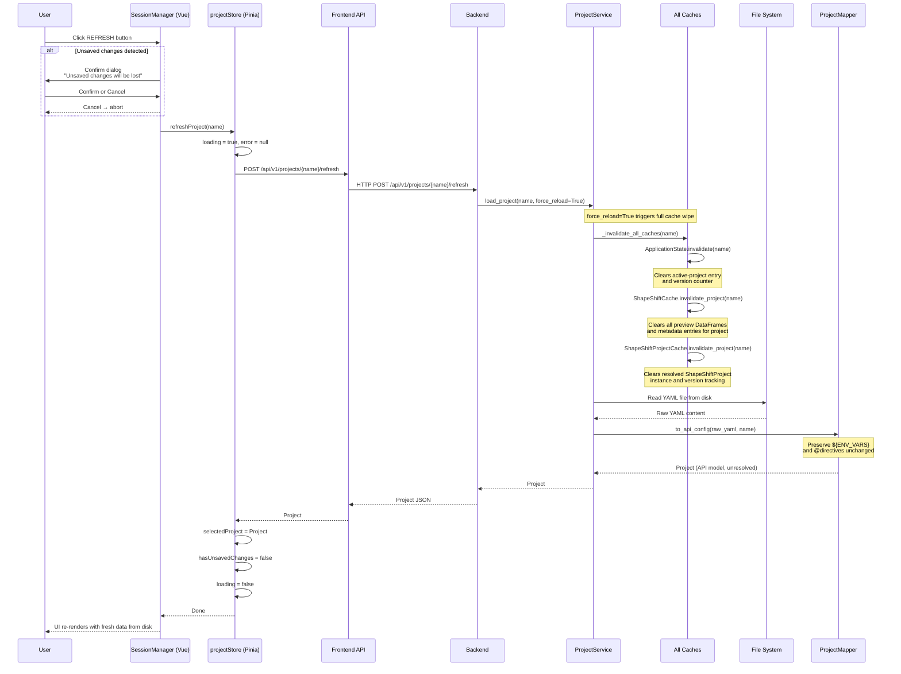

---

## 21. Entity Editing State

```mermaid
stateDiagram-v2
    direction LR

    [*] --> Unmodified : Project loaded
    Unmodified --> Editing : User edits field or YAML
    Editing --> Previewing : Debounce fires (300 ms)
    Previewing --> Editing : Cache miss – query running
    Previewing --> Unmodified : Save succeeds
    Editing --> Unmodified : Save succeeds
    Editing --> Error : Save fails (conflict / IO error)
    Error --> Editing : User corrects and retries
    Unmodified --> [*] : Project closed

    note right of Previewing
        POST /api/v1/preview
        3-tier cache checked
    end note

    note right of Error
        Version conflict or
        file system error
    end note

    classDef clean fill:#dff7e8,stroke:#2e9f5b,color:#1d3a29;
    classDef active fill:#e8f4fd,stroke:#4a90d9,color:#1a3a5c;
    classDef running fill:#fff7d6,stroke:#d6a300,color:#2b2b2b;
    classDef err fill:#ffe0e0,stroke:#d64545,color:#4a1f1f;

    class Unmodified clean;
    class Editing active;
    class Previewing running;
    class Error err;
```

---

## 22. Preview Cache State

```mermaid
stateDiagram-v2
    direction LR

    [*] --> Cold : Application start
    Cold --> Warming : Preview request received
    Warming --> Warm : Query succeeds + result cached
    Warming --> Cold : Query fails
    Warm --> Stale : Project YAML saved (version changed)
    Warm --> Stale : Entity config edited (hash changed)
    Warm --> Expired : TTL elapsed (300 s)
    Stale --> Warming : Next preview request
    Expired --> Warming : Next preview request

    note right of Warm
        TTL valid
        Version matches
        Hash matches
    end note

    note right of Stale
        Version or hash
        mismatch detected
    end note

    classDef cold fill:#eeeeee,stroke:#888,color:#333;
    classDef warming fill:#fff7d6,stroke:#d6a300,color:#2b2b2b;
    classDef warm fill:#dff7e8,stroke:#2e9f5b,color:#1d3a29;
    classDef stale fill:#fde8d0,stroke:#d48a2a,color:#4a2800;
    classDef expired fill:#ffe0e0,stroke:#d64545,color:#4a1f1f;

    class Cold cold;
    class Warming warming;
    class Warm warm;
    class Stale stale;
    class Expired expired;
```

---

## 23. Validation Result State

```mermaid
stateDiagram-v2
    direction LR

    [*] --> NotRun : Project opened
    NotRun --> Running : User triggers validation
    Running --> Valid : No issues found
    Running --> Invalid : Issues found
    Valid --> Stale : Project or entity modified
    Invalid --> Stale : Project or entity modified
    Stale --> Running : User re-runs validation
    Valid --> [*] : Project closed
    Invalid --> [*] : Project closed

    note right of Invalid
        Issues grouped by severity:
        error · warning · info
    end note

    note right of Stale
        Results shown but
        marked out-of-date
    end note

    classDef notrun fill:#eeeeee,stroke:#888,color:#333;
    classDef running fill:#fff7d6,stroke:#d6a300,color:#2b2b2b;
    classDef valid fill:#dff7e8,stroke:#2e9f5b,color:#1d3a29;
    classDef invalid fill:#ffe0e0,stroke:#d64545,color:#4a1f1f;
    classDef stale fill:#fde8d0,stroke:#d48a2a,color:#4a2800;

    class NotRun notrun;
    class Running running;
    class Valid valid;
    class Invalid invalid;
    class Stale stale;

```

---

## 24. Technology Stack

```mermaid
flowchart TB
    subgraph "Browser"
        B1[Modern Web Browser<br/>Chrome, Firefox, Safari]
    end
    
    subgraph "Frontend Technologies"
        F1[Vue 3<br/>Composition API]
        F2[Vuetify 3<br/>Material Design]
        F3[Pinia<br/>State Management]
        F4[TypeScript<br/>Type Safety]
        F5[Monaco Editor<br/>Code Editing]
        F6[Cytoscape.js<br/>Graph Visualization]
        F7[Vite<br/>Build Tool]
    end
    
    subgraph "Backend Technologies"
        BE1[FastAPI<br/>Python Framework]
        BE2[Pydantic v2<br/>Data Validation]
        BE3[SQLAlchemy<br/>ORM]
        BE4[Loguru<br/>Logging]
    end
    
    subgraph "Data Access"
        DA1[PostgreSQL Driver]
        DA2[SQLite Driver]
        DA3[UCanAccess<br/>MS Access]
        DA4[CSV/Excel Parsers]
    end
    
    subgraph "External Integrations"
        EX1[OpenRefine Protocol<br/>Reconciliation]
        EX2[SEAD Clearinghouse<br/>Dispatch Target]
    end
    
    B1 --> F1
    F1 --> F2 & F3 & F4 & F5 & F6
    F1 --> BE1
    F7 -.Build.-> F1
    
    BE1 --> BE2 & BE3 & BE4
    BE1 --> DA1 & DA2 & DA3 & DA4
    BE1 --> EX1 & EX2
```

---

## 25. Deployment Architecture

```mermaid
flowchart TB
    subgraph "Development"
        DEV1[Local Dev Server<br/>npm run dev]
        DEV2[Backend Dev<br/>uvicorn --reload]
    end
    
    subgraph "Production Deployment"
        NGINX[Nginx<br/>Reverse Proxy]
        
        subgraph "Frontend"
            FE[Static Assets<br/>Vite Build]
        end
        
        subgraph "Backend"
            API[FastAPI App<br/>Gunicorn/Uvicorn]
        end
        
        subgraph "Storage"
            FS[File System<br/>Project Configs]
            BACKUP[Backup Directory<br/>Auto-Rotation]
        end
    end
    
    subgraph "Data Sources"
        DB1[(PostgreSQL)]
        DB2[(SQLite)]
        FILES[CSV/Excel Files]
    end
    
    CLIENT[Web Browser] --> NGINX
    NGINX --> FE
    NGINX --> API
    
    API --> FS
    API --> BACKUP
    API --> DB1 & DB2 & FILES
    
    DEV1 -.->|Deploy| FE
    DEV2 -.->|Deploy| API
```

---

## 26. Registry Pattern (Extensibility)

```mermaid
flowchart TB
    subgraph "Core Registries"
        R1[Data Loaders<br/>Registry]
        R2[Validators<br/>Registry]
        R3[Dispatchers<br/>Registry]
        R4[Filters<br/>Registry]
    end
    
    subgraph "Registered Loaders"
        L1[PostgreSQL Loader]
        L2[SQLite Loader]
        L3[CSV Loader]
        L4[Excel Loader]
        L5[MS Access Loader]
        L6[Fixed Values]
    end
    
    subgraph "Registered Validators"
        V1[Cardinality Validator]
        V2[Unique Validator]
        V3[Foreign Key Validator]
        V4[Custom Validators]
    end
    
    subgraph "Registered Dispatchers"
        D1[SEAD Ingester]
        D2[Excel Dispatcher]
        D3[CSV Dispatcher]
        D4[Database Dispatcher]
        D5[Custom Dispatchers]
    end
    
    R1 --> L1 & L2 & L3 & L4 & L5 & L6
    R2 --> V1 & V2 & V3 & V4
    R3 --> D1 & D2 & D3 & D4 & D5
    
    PLUGIN[New Plugin] -.Register.-> R1
    PLUGIN -.Register.-> R2
    PLUGIN -.Register.-> R3

    classDef plugin fill:#fdf3e8,stroke:#d48a2a,color:#4a2800;

    class PLUGIN plugin;
```

---

**Document Version:** 1.0  
**Last Updated:** March 14, 2026  
**Purpose:** Visual documentation of Shape Shifter system architecture and workflows
