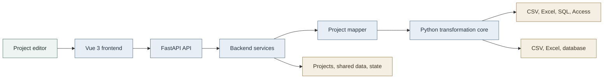
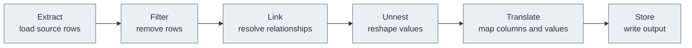
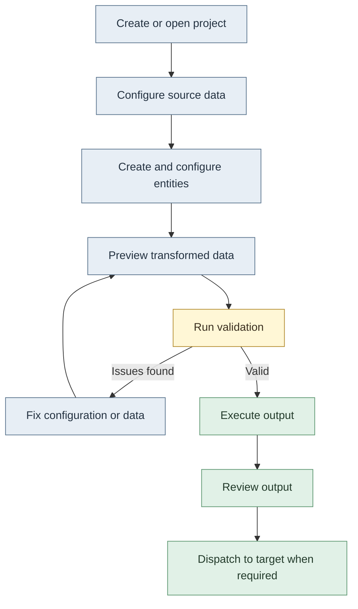
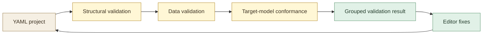
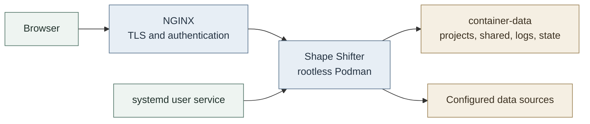
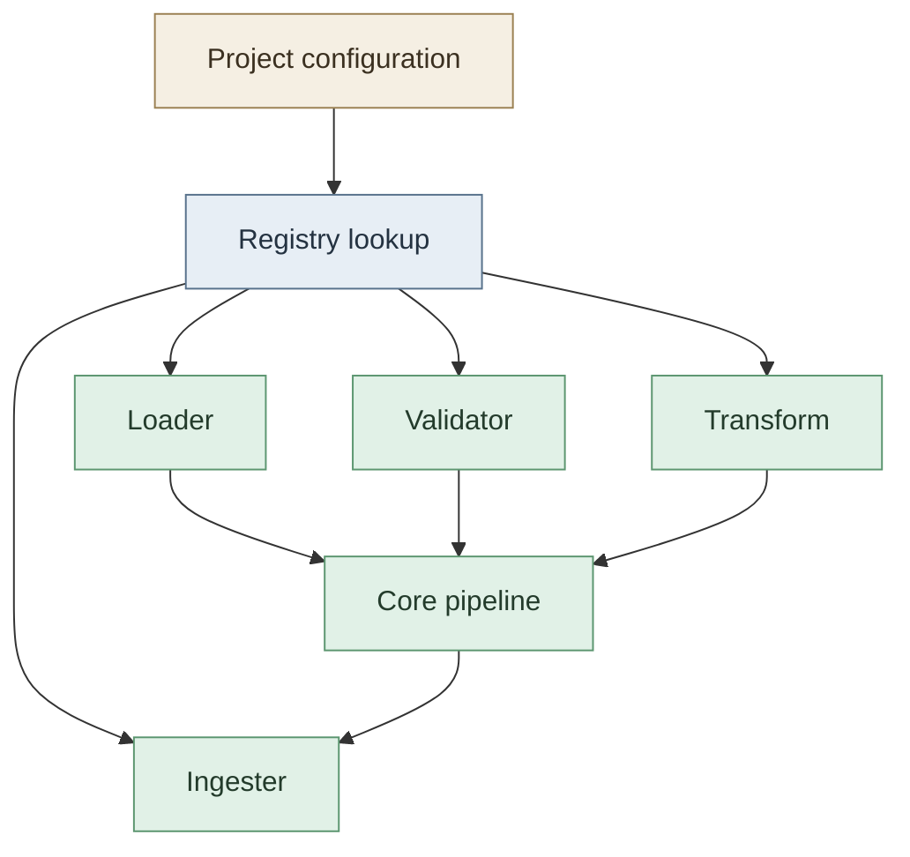
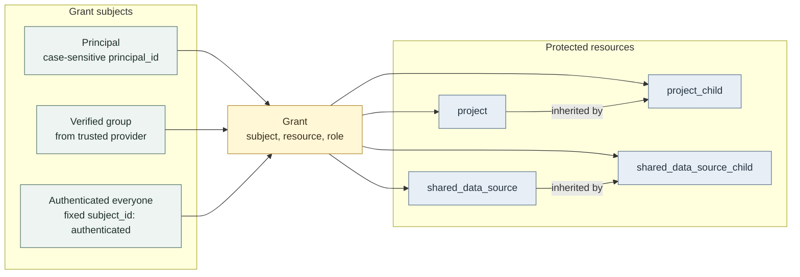
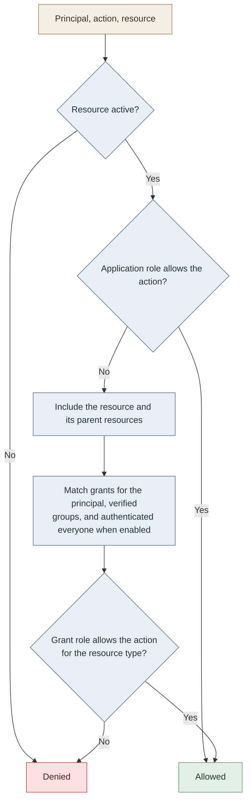

# Shape Shifter Diagrams

Current diagrams for the system structure, transformation flow, user workflow, deployment model, and authorization model. The written architecture and operational details live in [DESIGN.md](DESIGN.md) and [OPERATIONS.md](OPERATIONS.md).

## System Architecture

The repository is divided into a Vue frontend, a FastAPI adapter, and the Python core. API models do not cross into the core; mappers resolve API and YAML values before core processing.

```mermaid
flowchart LR
    User[Project editor] --> UI[Vue 3 frontend]
    UI --> API[FastAPI API]
    API --> Services[Backend services]
    Services --> Mapper[Project mapper]
    Mapper --> Core[Python transformation core]
    Core --> Sources[CSV, Excel, SQL, Access]
    Core --> Output[CSV, Excel, database]
    Services --> Files[Projects, shared data, state]

    classDef actor fill:#eef4f1,stroke:#527568,color:#1f302a;
    classDef app fill:#e7eef5,stroke:#58728c,color:#243241;
    classDef data fill:#f5efe3,stroke:#9b8153,color:#3b3020;
    class User actor;
    class UI,API,Services,Mapper,Core app;
    class Sources,Output,Files data;
```

## Transformation Pipeline

`ShapeShifter` runs these stages in order. Dependencies are resolved before downstream entities are processed.

```mermaid
flowchart LR
    Extract --> Filter --> Link --> Unnest --> Translate --> Store
    Extract[Extract\nload source rows]
    Filter[Filter\nremove rows]
    Link[Link\nresolve relationships]
    Unnest[Unnest\nreshape values]
    Translate[Translate\nmap columns and values]
    Store[Store\nwrite output]

    classDef stage fill:#e8f0f4,stroke:#58728c,color:#243241;
    class Extract,Filter,Link,Unnest,Translate,Store stage;
```

## Project Editing Workflow

The editor supports a repeatable path from project creation to delivery. Validation is part of the normal workflow, not a final-only check.

```mermaid
flowchart TD
    Start[Create or open project] --> Source[Configure source data]
    Source --> Entity[Create and configure entities]
    Entity --> Preview[Preview transformed data]
    Preview --> Validate[Run validation]
    Validate -->|Issues found| Fix[Fix configuration or data]
    Fix --> Preview
    Validate -->|Valid| Execute[Execute output]
    Execute --> Review[Review output]
    Review --> Dispatch[Dispatch to target when required]

    classDef action fill:#e7eef5,stroke:#58728c,color:#243241;
    classDef check fill:#fff7d6,stroke:#b28a2d,color:#3b3020;
    classDef delivery fill:#e1f1e7,stroke:#5c9670,color:#233b2b;
    class Start,Source,Entity,Preview,Fix action;
    class Validate check;
    class Execute,Review,Dispatch delivery;
```

## Validation Flow

Validation checks configuration, processed data, and target-model conformance at separate levels.

```mermaid
flowchart LR
    Project[YAML project] --> Structure[Structural validation]
    Structure --> Data[Data validation]
    Data --> Target[Target-model conformance]
    Target --> Result[Grouped validation result]
    Result --> Editor[Editor fixes]
    Editor --> Project

    classDef input fill:#f5efe3,stroke:#9b8153,color:#3b3020;
    classDef check fill:#fff7d6,stroke:#b28a2d,color:#3b3020;
    classDef result fill:#e1f1e7,stroke:#5c9670,color:#233b2b;
    class Project input;
    class Structure,Data,Target check;
    class Result,Editor result;
```

## Reconciliation Workflow

Reconciliation produces reviewed mappings in a sidecar file. Draft links do not affect normalization until they are committed.

```mermaid
flowchart LR
    Values[Entity values] --> Query[Reconciliation query]
    Query --> Matches[Candidate matches]
    Matches --> Review[Review and adjust]
    Review --> Draft[Draft mapping]
    Draft --> Commit[Commit accepted links]
    Commit --> Sidecar[Mapping sidecar]
    Sidecar --> Normalize[Normalization]

    classDef data fill:#f5efe3,stroke:#9b8153,color:#3b3020;
    classDef action fill:#e7eef5,stroke:#58728c,color:#243241;
    classDef stored fill:#e1f1e7,stroke:#5c9670,color:#233b2b;
    class Values,Matches data;
    class Query,Review,Commit,Normalize action;
    class Draft,Sidecar stored;
```

## Deployment Architecture

Production uses rootless Podman, file-backed persistent data, and an authenticated NGINX boundary. The container exposes plain HTTP only to the local proxy path.

```mermaid
flowchart LR
    Browser[Browser] --> Nginx[NGINX\nTLS and authentication]
    Nginx --> App[Shape Shifter\nrootless Podman]
    App --> Data[container-data\nprojects, shared, logs, state]
    App --> Database[Configured data sources]
    Systemd[systemd user service] --> App

    classDef external fill:#eef4f1,stroke:#527568,color:#1f302a;
    classDef runtime fill:#e7eef5,stroke:#58728c,color:#243241;
    classDef storage fill:#f5efe3,stroke:#9b8153,color:#3b3020;
    class Browser,Systemd external;
    class Nginx,App runtime;
    class Data,Database storage;
```

## Extensibility Registries

Loaders, validators, transforms, and ingesters are selected through registries so new implementations can be added without changing the orchestration flow.

```mermaid
flowchart TD
    Config[Project configuration] --> Registry[Registry lookup]
    Registry --> Loader[Loader]
    Registry --> Validator[Validator]
    Registry --> Transform[Transform]
    Registry --> Ingester[Ingester]
    Loader --> Pipeline[Core pipeline]
    Validator --> Pipeline
    Transform --> Pipeline
    Pipeline --> Ingester

    classDef config fill:#f5efe3,stroke:#9b8153,color:#3b3020;
    classDef registry fill:#e7eef5,stroke:#58728c,color:#243241;
    classDef component fill:#e1f1e7,stroke:#5c9670,color:#233b2b;
    class Config config;
    class Registry registry;
    class Loader,Validator,Transform,Ingester,Pipeline component;
```

## Authorization Model

A principal receives access through deployment-wide application roles and through grants on resources. A grant names one typed subject, one resource, and one role. A grant on a parent resource applies to its children; a grant on a child does not apply to its parent. The policy is described in [AUTHORIZATION.md](AUTHORIZATION.md), which lists the roles and the actions each role allows in the [resource roles](AUTHORIZATION.md#resource-roles) and [application roles](AUTHORIZATION.md#application-roles) tables.

### Grants And Resources

```mermaid
flowchart LR
    subgraph Subjects["Grant subjects"]
        Principal["Principal\ncase-sensitive principal_id"]
        Group["Verified group\nfrom trusted provider"]
        Everyone["Authenticated everyone\nfixed subject_id: authenticated"]
    end

    Grant["Grant\nsubject, resource, role"]

    Principal --> Grant
    Group --> Grant
    Everyone --> Grant

    subgraph Resources["Protected resources"]
        Project["project"]
        ProjectChild["project_child"]
        SharedSource["shared_data_source"]
        SharedChild["shared_data_source_child"]
    end

    Grant --> Project
    Grant --> ProjectChild
    Grant --> SharedSource
    Grant --> SharedChild

    Project -->|"inherited by"| ProjectChild
    SharedSource -->|"inherited by"| SharedChild

    classDef subject fill:#eef4f1,stroke:#527568,color:#1f302a;
    classDef grant fill:#fff7d6,stroke:#b28a2d,color:#3b3020;
    classDef resource fill:#e7eef5,stroke:#58728c,color:#243241;

    class Principal,Group,Everyone subject;
    class Grant grant;
    class Project,ProjectChild,SharedSource,SharedChild resource;
```

The fixed `authenticated` subject ID means every authenticated principal. Anonymous requests are still denied, and authenticated-`everyone` matching is disabled unless enabled in deployment configuration.

### Authorization Decision

The decision below applies to a resource-addressed request. An application-scoped request checks only the application role.

```mermaid
flowchart TD
    Request["Principal, action, resource"] --> Lifecycle{"Resource active?"}
    Lifecycle -->|"No"| Denied["Denied"]
    Lifecycle -->|"Yes"| ApplicationRole{"Application role allows the action?"}
    ApplicationRole -->|"Yes"| Allowed["Allowed"]
    ApplicationRole -->|"No"| Ancestors["Include the resource and its parent resources"]
    Ancestors --> Grants["Match grants for the principal, verified\ngroups, and authenticated everyone when enabled"]
    Grants --> ResourceRole{"Grant role allows the action\nfor the resource type?"}
    ResourceRole -->|"Yes"| Allowed
    ResourceRole -->|"No"| Denied

    classDef input fill:#f5efe3,stroke:#9b8153,color:#3b3020;
    classDef step fill:#e7eef5,stroke:#58728c,color:#243241;
    classDef result fill:#e1f1e7,stroke:#5c9670,color:#233b2b;
    classDef denied fill:#ffe0e0,stroke:#d64545,color:#4a1f1f;

    class Request input;
    class Lifecycle,ApplicationRole,Ancestors,Grants,ResourceRole step;
    class Allowed result;
    class Denied denied;
```

A missing proxy identity returns `401`. A missing application role returns `403`. A denied resource request returns `404 Resource not found` so the response does not reveal whether the resource exists.

### Reviewing Recorded Relationships

The `sead-authorization` commands print the relationships recorded in a deployment authorization database: `list-resources` for resources and lifecycle states, `list-grants` for grants, `list-application-roles` for application roles, and `list-audit-events` for recorded changes. Use `list-grants --effective --actor <principal>` to expand group subjects through the configured membership provider.
