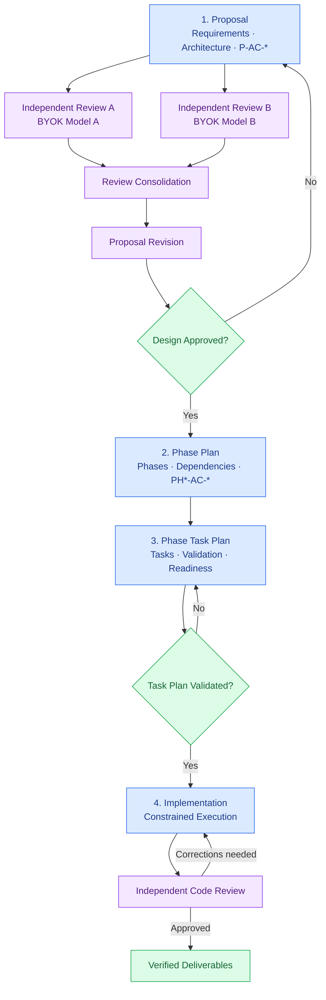

# Specification-Driven Development Process

## Overview

This development process uses a structured, specification-driven workflow to guide software changes from initial design through implementation and validation.

The central principle is to **make important decisions early, progressively reduce uncertainty, and constrain implementation to an approved specification**.

The process consists of four primary stages:

1. **Proposal** — Define the problem, evaluate alternatives, and establish the recommended design.
2. **Phase Plan** — Organize the approved design into ordered, verifiable delivery phases.
3. **Phase Task Plan** — Translate each phase into concrete, repository-verified implementation tasks.
4. **Implementation** — Execute validated task plans and verify the results.

Independent reviews, iterative refinement, and approval gates separate the stages. Each stage produces an authoritative input for the next, preserving decisions and traceability throughout development.

### Workflow Diagram



## Core Principles

**Decide before implementing.** Architectural decisions, requirements, constraints, and expected outcomes are established before implementation begins. Later stages must respect approved decisions rather than silently reinterpret them.

**Progressively reduce uncertainty.** Early stages explore problems and solutions. Later stages resolve dependencies, implementation details, and verification procedures until the remaining work is sufficiently constrained for reliable execution.

**Separate responsibilities.** Proposals establish what should change and why. Phase plans determine delivery order. Task plans specify how individual phases will be implemented. Implementation executes the validated tasks.

**Review independently and iteratively.** Important specifications are critically evaluated before approval. Different AI models may review the same document independently, challenging assumptions, identifying weaknesses, and proposing improvements. Reviews inform revisions rather than automatically determining them.

**Preserve traceability.** Requirements and acceptance criteria retain stable identifiers across documents, connecting proposal-level outcomes to phase criteria, implementation tasks, and validation evidence.

**Verify against the repository.** Repository inspection becomes progressively more detailed. Architectural claims, affected interfaces, implementation targets, and validation procedures must be grounded in actual source code and documentation.

**Constrain implementation freedom.** Once a task plan is validated, implementation should primarily execute defined tasks. Unexpected discrepancies or necessary design changes are escalated rather than resolved through unapproved redesign.

**Maintain human control.** AI assistants may analyze, recommend, review, plan, and implement, but responsibility for approving significant decisions and changes remains with the developer.

## Stage 1 — Proposal

**Skill:** `create-proposal`

The proposal establishes the problem, scope, recommended design, alternatives, risks, and expected outcomes.

This is the stage with the greatest freedom for architectural reasoning. Assumptions may be challenged, alternative approaches explored, and the recommended design refined.

Repository inspection is limited to what is necessary to verify current behavior, feasibility, interfaces, constraints, and migration risks. Detailed implementation inventories belong to later stages.

The proposal defines observable acceptance criteria using stable `P-AC-*` identifiers. When phase planning will follow, it includes a Planning Handoff recording confirmed decisions, constraints, preserved behavior, validation expectations, and unresolved questions.

**Output:** A decision-focused proposal ready for independent review.

## Proposal Review and Refinement

**Agent:** `proposal-review`

Before approval, the proposal undergoes independent critical review.

The review evaluates:

- Whether the proposed solution addresses the underlying problem.
- Technical correctness, feasibility, and architectural consistency.
- Simplicity, maintainability, and unnecessary complexity.
- Alternatives, assumptions, dependencies, and tradeoffs.
- Security, data integrity, compatibility, and operational risks.
- Acceptance criteria, validation strategy, and planning readiness.

Reviewers are encouraged to challenge fundamental design choices, not merely identify omissions or improve wording.

### Multi-Model Review

Multiple AI models may independently review the same proposal. Using different models can expose contrasting assumptions, alternative designs, and defects overlooked by an individual reviewer.

To preserve independence, reviewers should initially evaluate the same proposal without seeing each other's conclusions.

Reviews produce evidence-based findings and recommendations. Reviewers do not modify the proposal.

### Review Consolidation

Findings from independent reviews are compared and reconciled.

Duplicate findings are consolidated, unsupported findings are rejected, and conflicting assessments are investigated. Agreement among models is useful but does not establish correctness.

The consolidated review identifies the changes most likely to improve the proposal and distinguishes necessary corrections from optional improvements.

### Iterative Refinement

Accepted findings are incorporated using the `create-proposal` skill.

The revised proposal may undergo further independent review. This creates an iterative process:

**Draft → Independent Reviews → Consolidation → Revision → Re-review**

Iterations continue while material architectural weaknesses, unsupported assumptions, or unresolved decisions remain.

The objective is not unanimous model agreement, but a sound and sufficiently complete design.

### Design Approval

The developer reviews the final proposal and makes the approval decision.

A proposal is ready for phase planning when:

- The recommended design is sufficiently justified.
- Significant architectural risks are understood and addressed.
- Requirements and acceptance criteria are clear and verifiable.
- Essential decisions have been resolved.
- Remaining questions are explicitly documented and can safely be deferred.

Approval establishes the proposal as the authoritative specification for subsequent planning.

**Output:** An approved proposal with reviewed architectural decisions, acceptance criteria, and planning constraints.

## Stage 2 — Phase Plan

**Skill:** `create-phase-plan`

The phase plan transforms the approved proposal into an ordered sequence of delivery phases.

Each phase defines its goal, dependencies, expected outputs, acceptance criteria, validation milestones, and handoff requirements.

Phase acceptance criteria use `PH<N>-AC-<N>` identifiers and map back to the proposal's `P-AC-*` criteria.

The phase plan determines how the solution should be delivered without revisiting approved architectural choices.

A phase is ready for task planning only when no unresolved decision could materially change its implementation or validation.

**Output:** A sequenced delivery plan with explicit dependencies, measurable outcomes, and phase-level readiness conditions.

## Stage 3 — Phase Task Plan

**Skill:** `create-phase-task-plan`

The task plan translates one ready phase into a detailed, executable implementation specification.

This stage performs targeted repository analysis to identify affected files, symbols, interfaces, dependencies, tests, and data flows. Findings must be verified against current source code.

The plan defines concrete tasks (`T*`), validation checks (`V*`), expected deliverables, dependencies, and acceptance-criteria coverage.

Each task and validation check is linked to the relevant phase criteria, preserving traceability to the original proposal.

A task plan is marked **Validated** only when implementation targets and validation procedures have been verified and no blocking decisions remain.

**Output:** A repository-verified, validated task plan ready for implementation.

## Stage 4 — Implementation

**Skill:** `implement-phase-task-plan`

Implementation executes a validated task plan in dependency order.

Before making changes, the implementation agent verifies that the phase is ready, the task plan is validated, and the repository still matches the assumptions on which the plan was based.

The agent implements only the specified tasks and deliverables, preserving documented contracts, constraints, compatibility requirements, and architectural decisions.

Required validation checks are executed, and progress is recorded using actual evidence.

If the repository differs materially from the plan or an unexpected design decision becomes necessary, implementation stops and reports the discrepancy rather than improvising a solution.

Implementation results should undergo independent code review before integration, checking correctness, specification compliance, regressions, and validation evidence.

**Output:** Implemented and reviewed deliverables, validation results, updated progress tracking, and any unresolved issues.

## Traceability and Readiness

The process maintains an explicit chain from requirements to implementation evidence:

`P-AC-*` → `PH*-AC-*` → `T*` → `V*`

Each stage has a distinct readiness condition:

| Stage           | Readiness condition                                                 |
|-----------------|---------------------------------------------------------------------|
| Proposal        | Design reviewed and approved                                        |
| Phase Plan      | Dependencies, phase outcomes, and readiness established             |
| Phase Task Plan | Repository-verified and validated                                   |
| Implementation  | Tasks completed, validation evidence recorded, and changes reviewed |

Missing decisions, unverified assumptions, or material discrepancies are treated as blockers rather than implicitly delegated to later stages.

When new information invalidates an approved decision, the relevant earlier specification is revisited and affected downstream plans are updated.

## AI Model Strategy

The process deliberately assigns different levels of freedom to AI assistants.

| Activity             | Model responsibility                                           | Design freedom                             |
|----------------------|----------------------------------------------------------------|--------------------------------------------|
| Proposal creation    | Analyze problems, explore alternatives, recommend architecture | High                                       |
| Proposal review      | Challenge assumptions and evaluate competing designs           | High                                       |
| Review consolidation | Evaluate evidence, reconcile findings, prioritize revisions    | High                                       |
| Phase planning       | Organize approved decisions into verifiable delivery phases    | Moderate                                   |
| Task planning        | Analyze repository and specify implementation steps            | Low                                        |
| Implementation       | Execute validated tasks and report deviations                  | Very low                                   |
| Code review          | Independently verify correctness and compliance                | Analytical freedom, no authority to modify |

More capable reasoning models are particularly valuable during proposal creation, architectural review, and review consolidation.

As decisions are resolved and tasks become more precisely specified, less expensive models can perform implementation work within narrower constraints.

**The objective is to concentrate expensive reasoning where it creates the greatest value, while making implementation increasingly deterministic, testable, and economical.**

## Final Principle

The quality of implementation depends heavily on the quality of the specification.

The process therefore invests substantial effort in architectural reasoning, independent review, and detailed preparation before coding begins.

AI assistants are used not to replace engineering judgment, but to strengthen it through complementary analysis, systematic verification, and disciplined execution.


# APPENDICES

Yes, I think you should make GitHub Copilot aware of the process—but not by adding the entire document to its always-on instructions.

Your specification-driven workflow is more than documentation. It defines how the coding assistant should behave, particularly which decisions it may make at each stage and when it must stop and request clarification.

I recommend a three-layer approach:

| Layer                      | Purpose                                                         | Location                                               |
| -------------------------- | --------------------------------------------------------------- | ------------------------------------------------------ |
| 1. Repository instructions | Establish the development process and its governing rules       | `.github/copilot-instructions.md`                      |
| 2. Process documentation   | Explain the complete workflow, review loops, and approval gates | `docs/development/specification-driven-development.md` |
| 3. Skills and agents       | Implement individual stages and their constraints               | `.github/skills/` and `.github/agents/`                |

The key is to give Copilot just enough always-on context to recognize the process and respect its boundaries, while letting the individual skills provide detailed procedural instructions.

## Recommended repository instructions

Add the following section to your existing `.github/copilot-instructions.md`. I would keep it short—roughly 25 lines.

```

## Specification-Driven Development

This repository uses a specification-driven development process.

The authoritative process description is:
[Specification-Driven Development](../docs/development/specification-driven-development.md).

Development follows four stages:

1. **Proposal** — Establish requirements and design decisions.
2. **Phase Plan** — Organize delivery into verifiable phases.
3. **Phase Task Plan** — Specify repository-verified implementation tasks.
4. **Implementation** — Execute validated tasks and verify results.

### Rules

- Use the corresponding skill for each stage when applicable.
- Preserve traceability from `P-AC-*` to `PH*-AC-*`,
  implementation tasks (`T*`), and validation (`V*`).
- Do not silently change approved architectural decisions.
- Do not introduce major design decisions during implementation.
- Do not proceed past unresolved blocking decisions.
- Report discrepancies between specifications and repository state.
- Keep proposal, phase plan, task plan, and implementation
  responsibilities separate.
- Prefer independent review before approving significant designs
  or integrating substantial changes.

### Decision Authority

AI assistants may analyze, recommend, review, and implement.
The developer remains responsible for approving significant
design decisions and changes.

When a task conflicts with an approved specification, identify
the conflict rather than silently deviating from the design.

```

This doesn't force every request into the full workflow. Small bug fixes, exploratory work, and routine maintenance can still be handled directly. The process applies when a change is governed by a proposal or plan.

## Make the skills aware of the process

I would also add a brief reference near the beginning of each relevant `SKILL.md`:

```
## Development Process

Follow the repository's specification-driven development process
at `docs/development/specification-driven-development.md`.

This skill implements one stage of that process.
Preserve decisions and acceptance-criteria traceability
from preceding stages.

Do not assume responsibility for subsequent stages.

```

For better reliability, make the document path a proper relative Markdown link from each skill file. VS Code supports references to supporting files in skills and agent instructions. The referenced content can then be retrieved when needed rather than copied into every instruction.&#x20;

[image](https://www.google.com/s2/favicons?domain=https://github.com\&sz=32)

GitHub

+1


## A small adjustment for multiple AI tools

Since you also use coding assistants beyond Copilot, consider placing the shared rules in a root-level `AGENTS.md` instead of duplicating them across tool-specific instruction files.

Current VS Code documentation supports both `AGENTS.md` and `.github/copilot-instructions.md`, although recognition depends on the selected agent harness.&#x20;

[image](https://www.google.com/s2/favicons?domain=https://github.com\&sz=32)

GitHub


My preferred division would be:

- `AGENTS.md` — Shared principles, approval gates, and specification boundaries.
- `docs/development/specification-driven-development.md` — Full process explanation and diagram.
- `.github/skills/` — Stage-specific execution instructions.
- `.github/agents/` — Specialized reviewers and, eventually, review consolidation.

You can keep `.github/copilot-instructions.md` for Copilot-specific guidance, without duplicating the shared rules.

The most important rule to teach the coding assistant is not the sequence of stages, but the authority boundary: the AI can exercise substantial architectural judgment during proposal work and review, while implementation must respect the approved specification and validated task plan.

That distinction is what makes your process work with both capable reasoning models and inexpensive implementation models.
