# Shape Shifter - System Diagrams

Diagrams showing Shape Shifter's architecture, workflow, and capabilities.

---

## 1. The Problem: Data Integration Chaos

```mermaid
flowchart LR
    subgraph "Data Providers"
        P1[<b>Provider</b> A<br/>Excel Spreadsheet]
        P2[<b>Provider</b> B<br/>Access Database]
        P3[<b>Provider</b> C<br/>CSV Files]
        P4[<b>Provider</b> D<br/>Database]
    end
    
    subgraph "Manual Integration Pain Points"
        M1[❌ Manual Column Mapping]
        M2[❌ Inconsistent Formats]
        M3[❌ Manual & Error-Prone Transformations]
        M4[❌ ID Lookup Nightmares]
        M5[❌ Weeks of Work Per Dataset]
        M6[❌ Hard to Reproduce]
    end
    
    subgraph "<b>SEAD</b>"
        S[Requires:<br/>✓ Standard Schema<br/>✓ Valid IDs<br/>✓ Clean Data<br/>✓ Documented Provenance]
    end
    
    P1 --> M1
    P2 --> M2
    P3 --> M3
    P4 --> M4
    M1 --> M5
    M2 --> M5
    M3 --> M5
    M4 --> M6
    M5 --> S
    M6 --> S

    style P1 fill:#ffffff,color:#000000,stroke:#ffffff,stroke-width:2px
    style P2 fill:#ffffff,color:#000000,stroke:#ffffff,stroke-width:2px
    style P3 fill:#ffffff,color:#000000,stroke:#ffffff,stroke-width:2px
    style P4 fill:#ffffff,color:#000000,stroke:#ffffff,stroke-width:2px
    
    style M1 fill:#ffffff,color:#000000,stroke:#ffffff,stroke-width:2px
    style M2 fill:#ffffff,color:#000000,stroke:#ffffff,stroke-width:2px
    style M3 fill:#ffffff,color:#000000,stroke:#ffffff,stroke-width:2px
    style M4 fill:#ffffff,color:#000000,stroke:#ffffff,stroke-width:2px
    style M5 fill:#ffffff,color:#000000,stroke:#ffffff,stroke-width:2px
    style M6 fill:#ffffff,color:#000000,stroke:#ffffff,stroke-width:2px

    style S fill:#ffffff,color:#000000,stroke:#ffffff,stroke-width:2px

```

---

## 2. The Solution: Shape Shifter Integration Platform

```mermaid
flowchart LR
    subgraph "Data Sources "
        DS1[<b>Provider</b> A<br/>Excel Spreadsheet]
        DS2[<b>Provider</b> B<br/>Access Database]
        DS3[<b>Provider</b> C<br/>CSV Files]
        DS4[<b>Provider</b> D<br/>Database]
    end
    
    subgraph "Shape Shifter Platform"
        direction TB
        SS1[📝 Configure Once<br/>Declarative YAML]
        SS2[✅ Automatic Validation<br/>Multi-Level Checks]
        SS3[🔗 Identity Reconciliation<br/>Auto-Matching + Review]
        SS4[🔄 Transformation Engine<br/>Reproducible Pipeline]
        SS5[📊 Preview & Verify<br/>Before Commit]
    end
    
    subgraph "<b>SEAD</b>"
        SEAD[✓ Validated Data<br/>✓ Resolved IDs<br/>✓ Documented Lineage<br/>✓ Ready to Import]
    end
    
    DS1 --> SS1
    DS2 --> SS1
    DS3 --> SS1
    DS4 --> SS1
    
    SS1 --> SS2
    SS2 --> SS3
    SS3 --> SS4
    SS4 --> SS5
    SS5 --> SEAD

    style DS1 fill:#ffffff,color:#000000,stroke:#ffffff,stroke-width:2px
    style DS2 fill:#ffffff,color:#000000,stroke:#ffffff,stroke-width:2px
    style DS3 fill:#ffffff,color:#000000,stroke:#ffffff,stroke-width:2px
    style DS4 fill:#ffffff,color:#000000,stroke:#ffffff,stroke-width:2px
    
    style SS1 fill:#ffffff,color:#000000,stroke:#ffffff,stroke-width:2px
    style SS2 fill:#ffffff,color:#000000,stroke:#ffffff,stroke-width:2px
    style SS3 fill:#ffffff,color:#000000,stroke:#ffffff,stroke-width:2px
    style SS4 fill:#ffffff,color:#000000,stroke:#ffffff,stroke-width:2px
    style SS5 fill:#ffffff,color:#000000,stroke:#ffffff,stroke-width:2px

    style SEAD fill:#ffffff,color:#000000,stroke:#ffffff,stroke-width:2px
```

---

## 3. Complete User Workflow

---

## 4. System Architecture

---

## 5. Tabbed Project Interface

```mermaid
flowchart TB
    subgraph "Project Detail View"
        direction LR
        
        subgraph "Tabs"
            direction TB
            T1[📋 Entities]
            T2[🔗 Dependencies]
            T3[✅ Validation]
            T4[🔄 Reconciliation]
            T5[📤 Dispatch]
            T6[📝 YAML]
        end
        
        subgraph "Entities Tab"
            E1[Entity List]
            E2[Create/Edit Forms]
            E3[Preview Data]
        end
        
        subgraph "Dependencies Tab"
            D1[Interactive Graph]
            D2[Hierarchical View]
            D3[Force-Directed Layout]
        end
        
        subgraph "Validation Tab"
            V1[Run All Validations]
            V2[Error Summary]
            V3[Auto-Fix Suggestions]
        end
        
        subgraph "Reconciliation Tab"
            R1[Form Editor]
            R2[Auto-Reconcile]
            R3[Review Grid]
        end
        
        subgraph "Dispatch Tab"
            DI1[Select Ingester]
            DI2[Configure Target]
            DI3[Validate & Send]
        end
        
        T1 -.-> E1 & E2 & E3
        T2 -.-> D1 & D2 & D3
        T3 -.-> V1 & V2 & V3
        T4 -.-> R1 & R2 & R3
        T5 -.-> DI1 & DI2 & DI3
    end
```

---

## 6. Data Transformation Pipeline

---

## 7. Reconciliation Workflow

---

## 8. Validation System Architecture

---

## 9. Caching Strategy (ShapeShift Service)

---

## 10. Time Savings Comparison

**Traditional:** ~48 hours per dataset  
**Shape Shifter (First Time):** ~3.5 hours  
**Shape Shifter (Repeat):** ~15 minutes  

---

## 11. Key Features Overview

---

## 12. User Personas & Use Cases

```mermaid
flowchart LR
    subgraph "Domain Data Manager"
        U1[📊 Archaeologist<br/>Limited Programming]
        UC1[Create Configurations<br/>Using Forms]
        UC2[Validate Data<br/>Before Submission]
        UC3[Preview Results<br/>Visually]
    end
    
    subgraph "Data Engineer"
        U2[🔧 Technical User<br/>SQL/Database Skills]
        UC4[Complex Queries<br/>& Transformations]
        UC5[Schema<br/>Introspection]
        UC6[Performance<br/>Optimization]
    end
    
    subgraph "Developer/Integrator"
        U3[💻 Software Dev<br/>API Integration]
        UC7[Programmatic<br/>Configuration]
        UC8[Pipeline<br/>Automation]
        UC9[Custom<br/>Validators]
    end
    
    U1 --> UC1 & UC2 & UC3
    U2 --> UC4 & UC5 & UC6
    U3 --> UC7 & UC8 & UC9
    
    UC1 & UC2 & UC3 & UC4 & UC5 & UC6 & UC7 & UC8 & UC9 --> RESULT[Clean Data<br/>Ready for SEAD]
    
    style U1 fill:#e6f3ff
    style U2 fill:#fff0e6
    style U3 fill:#ffe6f0
    style RESULT fill:#ccffcc
```

---

## 13. Technology Stack

---

## 14. Deployment Architecture

---

## 15. Registry Pattern (Extensibility)

---

**Document Version:** 1.0  
**Last Updated:** January 12, 2026  
**Purpose:** Visual documentation of Shape Shifter system architecture and workflows
