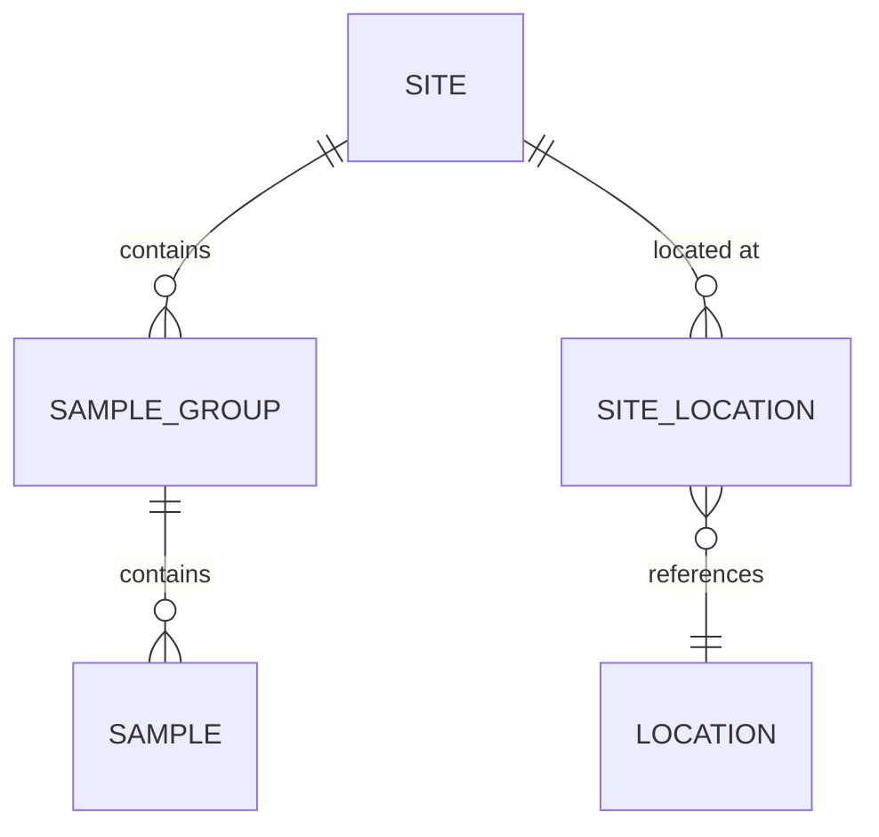

# Target Model Documentation for Non-Technical Users

This guide explains how to generate human-readable documentation from the SEAD target model YAML specifications for archaeologists, data managers, and other non-technical stakeholders.

## Quick Start

```bash
# Generate all formats (HTML, Markdown, Excel)
python scripts/generate_target_model_docs.py resources/target_models/sead_standard_model.yml

# Generate only HTML (recommended for stakeholders)
python scripts/generate_target_model_docs.py resources/target_models/sead_standard_model.yml --format html

# Generate Excel for spreadsheet review
python scripts/generate_target_model_docs.py resources/target_models/sead_standard_model.yml --format excel
```

Output files are created in `docs/generated/`:
- `sead_standard_model.html` - Interactive web page
- `sead_standard_model.md` - Markdown documentation
- `sead_standard_model.xlsx` - Excel workbook

## Documentation Formats

### 1. HTML (Interactive Web Documentation) ⭐ Recommended

**Best for:** Stakeholder presentations, team collaboration, reference documentation

**Features:**
- ✅ Visual entity cards with color-coded domains
- ✅ Live search/filter functionality
- ✅ Relationship display with visual arrows
- ✅ Statistics dashboard (total entities, relationships, domains)
- ✅ No software required (open in any web browser)
- ✅ Mobile-friendly responsive design

**Usage:**
```bash
python scripts/generate_target_model_docs.py resources/target_models/sead_standard_model.yml --format html
open docs/generated/sead_standard_model.html
```

**What non-technical users see:**
- **Entity cards** showing name, description, role, and requirements
- **Domain groupings** (spatial, dating, taxonomy, etc.)
- **Relationship arrows** (`site → location via site_location`)
- **Search box** to find entities by name or keyword
- **Statistics** showing model completeness

### 2. Excel Workbook (Spreadsheet Format)

**Best for:** Review sessions, annotation, gap analysis workshops

**Features:**
- ✅ Three sheets: Entities, Columns, Relationships
- ✅ Sortable and filterable tables
- ✅ Easy to add comments and notes
- ✅ Can track review status with additional columns
- ✅ Export to PDF for reports

**Usage:**
```bash
python scripts/generate_target_model_docs.py resources/target_models/sead_standard_model.yml --format excel
```

**Sheets included:**

**Entities Sheet:**
| Entity | Target Table | Required | Role | Public ID | Domains | Column Count | FK Count | Description                  |
|--------|--------------|----------|------|-----------|---------|--------------|----------|------------------------------|
| site   | tbl_sites    | Yes      | data | site_id   | spatial | 8            | 2        | Archaeological site location |

**Columns Sheet:**
| Entity | Column    | Type   | Required | Nullable | Description             |
|--------|-----------|--------|----------|----------|-------------------------|
| site   | site_name | string | Yes      | No       | Site name or identifier |

**Relationships Sheet:**
| From Entity | To Entity | Via Bridge    | Required |
|-------------|-----------|---------------|----------|
| site        | location  | site_location | Yes      |

### 3. Markdown Documentation

**Best for:** GitHub wikis, technical documentation, version control

**Features:**
- ✅ Plain text format (easy to diff/track changes)
- ✅ Renders nicely on GitHub/GitLab
- ✅ Can be converted to PDF/Word
- ✅ Grouped by domain with collapsible sections
- ✅ Tables for columns and relationships

**Usage:**
```bash
python scripts/generate_target_model_docs.py resources/target_models/sead_standard_model.yml --format markdown
```

## Use Cases

### Use Case 1: Stakeholder Presentation

**Scenario:** Present the target model to archaeology team

**Recommended format:** HTML

**Workflow:**
1. Generate HTML: `python scripts/generate_target_model_docs.py resources/target_models/sead_standard_model.yml --format html`
2. Open in browser: `open docs/generated/sead_standard_model.html`
3. Use search to demonstrate entity lookup ("search for 'dendro'")
4. Show domain groupings (spatial, dating, taxonomy)
5. Click through relationships to show data flow

**Benefits:**
- Visual and interactive
- No technical jargon
- Easy to navigate
- Works offline

### Use Case 2: Gap Analysis Workshop

**Scenario:** Review model completeness with domain experts

**Recommended format:** Excel

**Workflow:**
1. Generate Excel: `python scripts/generate_target_model_docs.py resources/target_models/sead_standard_model.yml --format excel`
2. Distribute to archaeologists: `docs/generated/sead_standard_model.xlsx`
3. Experts add columns: "Coverage Assessment", "Priority", "Comments"
4. Review in group session with screenshare
5. Collect feedback via updated Excel file

**Benefits:**
- Familiar spreadsheet interface
- Easy to add annotations
- Track review status
- Generate reports

### Use Case 3: Data Dictionary for Data Managers

**Scenario:** Document entities for data migration team

**Recommended format:** Markdown + Excel

**Workflow:**
1. Generate both: `python scripts/generate_target_model_docs.py resources/target_models/sead_standard_model.yml --format all`
2. Share Markdown on wiki: Copy `sead_standard_model.md` to project wiki
3. Distribute Excel: Send `sead_standard_model.xlsx` for detailed review
4. Update both as model evolves

**Benefits:**
- Version-controlled (Markdown)
- Easy lookup (Excel)
- Complete reference
- Professional documentation

## Advanced: Visual Diagrams

For entity-relationship diagrams (ERDs), use additional tools:

### Option 1: Mermaid Diagrams (Markdown)

Add to the markdown generator to create diagrams:



### Option 2: GraphViz DOT

Generate `.dot` files for professional diagrams:

```python
def generate_graphviz_erd(model: TargetModel) -> str:
    """Generate GraphViz DOT format for ERD."""
    dot = "digraph TargetModel {\n"
    dot += "  rankdir=LR;\n"
    dot += "  node [shape=box];\n\n"
    
    for entity_name, entity_spec in model.entities.items():
        for fk in entity_spec.foreign_keys:
            style = "solid" if fk.required else "dashed"
            dot += f'  "{entity_name}" -> "{fk.entity}" [style={style}];\n'
    
    dot += "}\n"
    return dot
```

Then render: `dot -Tpng model.dot -o model.png`

## Comparison Table

| Format       | Best For                 | Ease of Use | Interactivity | Editability | Version Control |
|--------------|--------------------------|-------------|---------------|-------------|-----------------|
| **HTML**     | Presentations, Reference | ⭐⭐⭐⭐⭐       | ⭐⭐⭐⭐⭐         | ❌           | ❌               |
| **Excel**    | Workshops, Review        | ⭐⭐⭐⭐⭐       | ⭐⭐            | ⭐⭐⭐⭐⭐       | ❌               |
| **Markdown** | Documentation, Wikis     | ⭐⭐⭐         | ❌             | ⭐⭐⭐         | ⭐⭐⭐⭐⭐           |
| **Diagrams** | Visual communication     | ⭐⭐          | ❌             | ⭐⭐          | ⭐⭐⭐             |

## Tips for Non-Technical Users

### Understanding Entity Cards (HTML)

```
┌─────────────────────────────────────┐
│ sample_group                        │  ← Entity name
│ → tbl_sample_groups                 │  ← Database table
│ [Required] [data]                   │  ← Status badges
│                                     │
│ Collection of related samples       │  ← Description
│ 📊 6 column(s)                      │  ← Metadata
│                                     │
│ sample_group → site (required)      │  ← Relationships
│ sample_group → method               │
└─────────────────────────────────────┘
```

### Reading Relationship Arrows

- `entity_a → entity_b` = "entity_a references entity_b"
- `(required)` = Must have this relationship
- `via bridge_entity` = Relationship goes through another entity
- Example: `site → location via site_location` means site connects to location through a bridge table

### Understanding Badges

- **Required** (red) = Must be included in every project
- **Optional** (green) = Can be omitted if not needed
- **Role badges** (blue):
  - `data` = Main data entity with measurements/observations
  - `classifier` = Lookup table/controlled vocabulary
  - `bridge` = Connects two other entities

## Automation

Add to your CI/CD pipeline to regenerate docs on model changes:

```bash
# In .github/workflows/docs.yml
- name: Generate target model docs
  run: |
    python scripts/generate_target_model_docs.py resources/target_models/sead_standard_model.yml --format all
    python scripts/generate_target_model_docs.py resources/target_models/sead_standard_model.yml --format all
```

## Feedback Collection

Use Excel format to collect structured feedback:

1. Generate base Excel file
2. Add review columns:
   - "Complete?" (Yes/No/Partial)
   - "Priority" (High/Medium/Low)
   - "Reviewer Comments"
   - "Status" (Approved/Needs Work/Not Needed)
3. Distribute to domain experts
4. Consolidate feedback
5. Update YAML based on consensus

---

