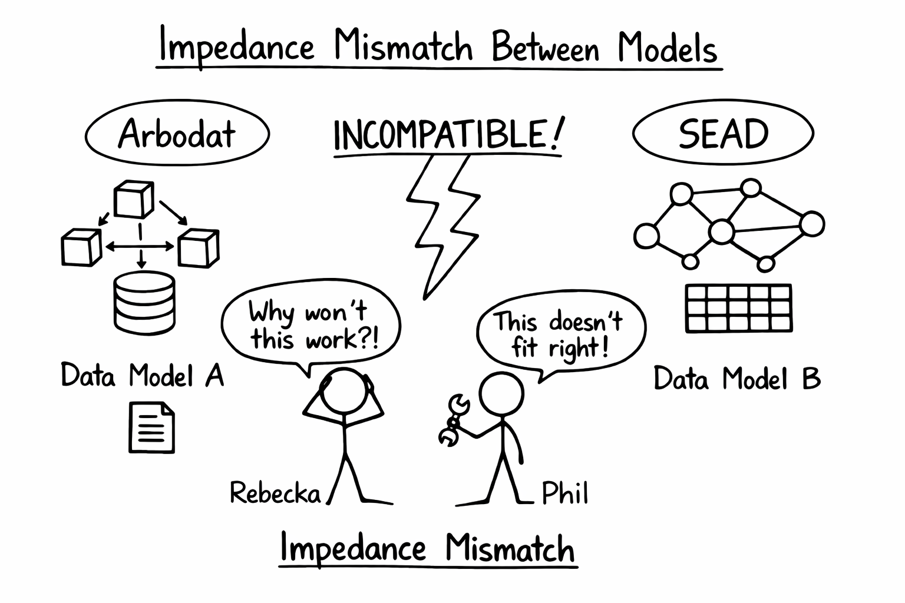
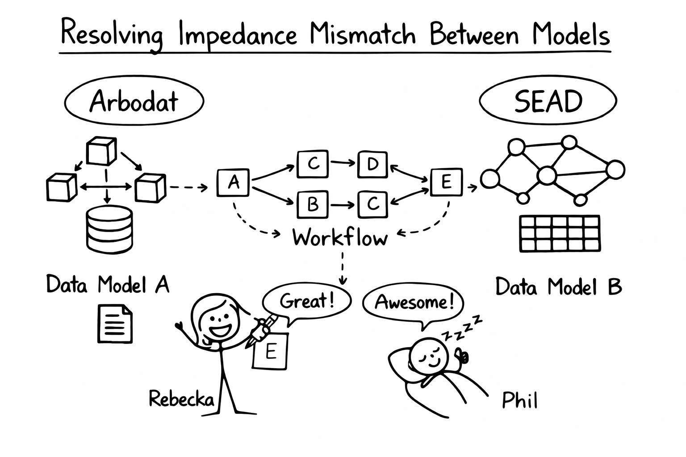
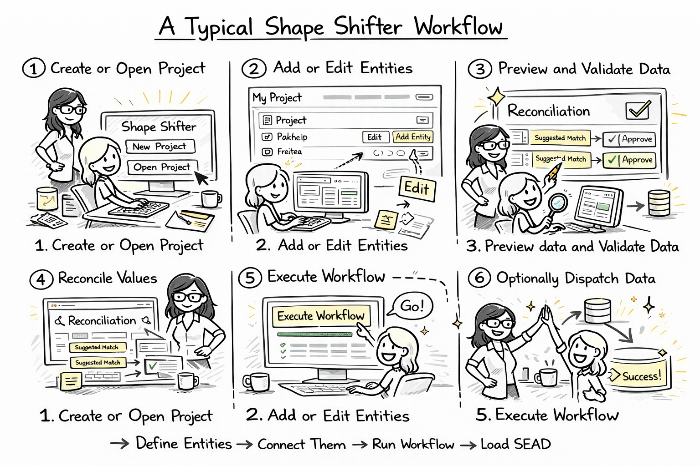

# Shape Shifter Project Editor - User Guide

## Table of Contents

1. [Introduction](#1-introduction)
2. [Getting Started](#2-getting-started)
3. [Project Workspace](#3-project-workspace)
4. [Managing Entities](#4-managing-entities)
5. [Validation](#5-validation)
6. [Reconciliation and Dispatch](#6-reconciliation-and-dispatch)
7. [Execute Workflow](#7-execute-workflow)
8. [Tips & Best Practices](#8-tips--best-practices)
9. [Troubleshooting](#9-troubleshooting)
10. [FAQ](#10-faq)

---

## 1. Introduction

### What Problem does Shape Shifter Solve?

Shape Shifter exists to solve a common data-integration problem: data provider's data is usually collected for one purpose, but needs to be delivered in a different structure for another system. In practice, that means spreadsheets, databases, and exports often contain the right information in the wrong shape, with different names, different identifiers, and different relationship rules.

### What Is the Impedance Mismatch?

The __impedance mismatch__ is the gap between how the data provider's source data is organized and how the SEAD system expects to receive it. A data provider might store values in flat files, repeated columns, informal names, or local business keys, while the SEAD expects normalized entities, stable identifiers, explicit foreign keys, and has it's own controlled vocabularies.



Shape Shifter bridges that gap by letting you define how data should be extracted, restructured, linked, validated, and exported into a format that can be ingested by SEAD.



### What Is Reconciliation?

Reconciliation is the step where local values are matched to authoritative records in an external system such as SEAD. For example, a site name, taxon name, or method name in your source data may need to be linked to a specific controlled record and ID in the target authority. Shape Shifter supports that workflow by helping you configure reconciliation rules, run automatic matching, review uncertain matches, and save the final mappings before export or dispatch.

Shape Shifter can consume any service that adhers to the OpenRefine service API protocol.

### What Shape Shifter Does

Shape Shifter is a configuration-driven data transformation system. You describe how source data should be loaded, linked, reshaped, validated, reconciled, and exported in YAML, and the editor gives you a UI for working with that configuration.

The current editor is built around a single project workspace with tabs for entities, dependency graph, reconciliation, validation, dispatch, data sources, metadata, files, and raw YAML editing.

### Core Concepts

**Project**
: A YAML-based transformation configuration stored in the project directory. The file is in part similar to an SQL DDL schema file (i.e. and ERD) in that it describes entities and their relationships. The file, though, also
contains configuration more relatable to a so called ETL-system (Extract - Transform - Load), in that it
specifies the data loading, transformation and dispatch for each of the entities.

**Entity**
: A logical (analog to a) table in the transformation pipeline. Entity's data can come from another entity, a SQL query, fixed values, CSV, Excel or any other configured data source. Contained within the entity is the configuration on what transformations are needed to produce the target data the entity represents (given it's source data). This
aspect of an entity resembles a SQL query or an SQL UDF.

**Lookup Entity**
: An entity that defines reference data or categorical values (e.g., species list, method types, age categories). Lookup entities are referenced by fact entities rather than containing measurements themselves.

**Fact Entity**
: An entity that records observations, measurements, or events that reference lookup entities and parent entities. Fact entities contain the actual data points (e.g., sample measurements, dating observations) and use foreign keys to link to lookups and shared parents.

**Value Objects** (Configuration Specifications)
: Immutable configuration components defined entirely by their attributes, with no independent identity. Key value objects include: **Foreign Key** (`foreign_keys`) - relationship specifications with local/remote keys and join type; **Filter** (`filters`) - staged filter conditions; **Unnest** (`unnest`) - wide-to-long transformation specs; **Append** (`append`) - data concatenation rules; and **Constraints** - validation rules for foreign keys. These components belong to entities and are replaced (not modified) when configuration changes.

**System ID** (`system_id`)
: The local sequential ID generated by Shape Shifter. It is always named `system_id` and is used for internal relationships. This ID is auto-managed by Shape Shifter.

**Business Keys** (`keys`)
: Natural, possibly compound key (set of columns) found in the source data used for deduplication, reconciliation, and specifying entity relationships.

**Public ID** (`public_id`)
: The target-side (i.e. SEAD) primary key column name. It must end with `_id` and determines foreign-key column names in child entities. This is currently limited to an integer ID, but future version will allow compound keys and UUIDs 

**Execute**
: Runs the full normalization workflow and exports data through a dispatcher such as Excel, ZIP CSV, folder CSV, or to a database (e.g. SEAD ClearingHouse). Dispatcher's are pluggable components that can be tailor-made for specific needs. 

**Dispatch**
: Sends already processed data to a downstream target system (i.e. SEAD) using ingester configuration defined in the project.

### Typical Workflow

1. Create or open a project.
2. Add or edit entities.
3. Preview data and validate the configuration.
4. Reconcile values if the project uses reconciliation.
5. Execute the workflow to export normalized data.
6. Optionally dispatch the processed data to an external target system.

---



---

## 2. Getting Started

### Open the Projects View

The **Projects** page is the main entry point.

From there you can:

- Search and sort projects.
- Create a new project.
- Open, copy or delete an existing project.
- Run quick validation from the project list.

### Create a New Project

1. Open **Projects**.
2. Click **New Project**.
3. Enter the project name.
4. Open the new project when creation completes.

### Open an Existing Project

1. Open **Projects**.
2. Search or sort until you find the project.
3. Click the project row or the edit button.

### What You See in a Project

The project detail screen includes:

- A header with **Execute**, **Backups**, **Refresh**, and **Save Changes**.
- A session banner showing whether the project is active, modified, or being edited in multiple sessions.
- A validation status chip when validation has been run.
- A tabbed workspace for the rest of the project tools.

### Concurrent Editing and Save Protection

When a project is open, the editor starts a session for it. If another session is editing the same project, the session banner shows a warning. Saves use version checks, so a save can be rejected if another user changed the project since you last saved or opened it.

If that happens you need to refresh the project, review the latest YAML or form state, re-apply your changes, and save again.

---

## 3. Project Workspace

### Workspace Tabs

The current project editor is organized into tabs:

| Tab              | Purpose                                                                                      |
|------------------|----------------------------------------------------------------------------------------------|
| **Entities**     | Create, search, filter, edit, and delete entities                                            |
| **Graph**        | Visualize dependencies, sources, task status, and open quick editing tools                   |
| **Reconcile**    | Configure reconciliation specs, edit reconciliation YAML, and review suggested matches       |
| **Validate**     | Run YAML validation and data validation, review issues, and copy results                     |
| **Dispatch**     | Send processed data to a configured target system using ingester settings                    |
| **Data Sources** | Connect shared data-source definitions to the project and create entities from source tables |
| **Metadata**     | Edit description, version, and default entity                                                |
| **Files**        | Upload project-local CSV and Excel files                                                     |
| **YAML**         | Edit the complete project YAML directly                                                      |

### Header Actions

| Button       | Purpose                                                             |
|--------------|---------------------------------------------------------------------|
| Execute      | Opens the execution dialog for exporting normalized data.           |
| Backups      | Opens a list of available project backups and lets you restore one. |
| Refresh      | Reloads the current project from disk.                              |
| Save Changes | Saves the current project after version checks.                     |

### Graph Tab

The **Graph** tab is the replacement for the older tree-style navigation. It shows entities, dependencies, and optionally source objects.

Available interactions include:

- Click a node to open the quick note or YAML drawer.
- Double-click a node to open the full entity editor overlay.
- Ctrl/Cmd + double-click a node to open the entity editor directly on the YAML tab.
- Right-click a node for actions such as preview, duplicate, delete, and task-status operations.
- Switch layout modes and save a custom layout.
- Color the graph by entity type or task status.
- Export the graph as PNG.

The graph also shows task completion, dependency counts, and cycle warnings when circular dependencies are detected.

### Metadata, Files, and Data Sources

These tabs support project setup around the entities themselves:

- **Metadata** edits project description, version, and default entity.
- **Files** uploads project-local `.csv`, `.xls`, and `.xlsx` files.
- **Data Sources** connects shared/global data source definitions into the current project and can launch entity creation from a selected source table.

### YAML Tab

Use the **YAML** tab is a power-user editing feature when you need full control over the project file.

The YAML editor supports, syntax-aware editing, reload from disk, explicit save and some validation while you edit.

Use it for bulk edits, advanced directive usage, or cases where the form editor does not expose a setting directly.

---

## 4. Managing Entities

### Entities Tab

The **Entities** tab now uses a searchable list rather than the older left-hand entity tree.

You can search entities by name, filter by type, and open or delete an entity.

Entity rows may also show extra badges such as:

- **Materialized** for entities with frozen cached output
- **External** when values are loaded from external storage rather than inline YAML

### Supported Entity Types

The current editor supports these main entity types:


| Type       | Data Source       | Description                                                            |
|------------|-------------------|------------------------------------------------------------------------|
| `entity`   | another entity    | derived entities get their data from another configured entity.        |
| `sql`      | database          | for query-based entities that reads data from en external data source. |
| `fixed`    | inline            | for manually added static values (also frozen dynamic entities)        |
| `csv`      | CSV/TSV file      | for loading data from delimited files                                  |
| `xlsx`     | Excel spreadsheet | for loading Excel spreadsheet using Pandas                             |
| `openpyxl` | Excel spreadsheet | for loading Excel spreadsheet with range support                       |

### Entity Editor Modes

When you create or edit an entity, the form dialog supports three view modes:

- **Form Only** for focused form editing
- **Split View** for side-by-side form and preview work
- **Preview Only** for data inspection

The split view can be toggled with **Ctrl+Shift+P**.

### Entity Editor Tabs

The entity editor is divided into focused tabs:

- **Basic**
- **Foreign Keys**
- **Filters**
- **Unnest**
- **Append**
- **Extra Columns**
- **Replace**
- **YAML**

New entities start in **Basic**. The remaining tabs become available once the entity exists.

### Identity Fields

The editor makes the three-tier identity system explicit:

**System ID**
: Always `system_id`. Read-only in the form.

**Public ID**
: Required target-facing ID column. Must end with `_id`.

**Business Keys**
: Natural keys used for matching and deduplication.

Use these carefully. In current Shape Shifter behavior:

- foreign-key column names come from the parent entity's `public_id`
- foreign-key values still point to the parent entity's local `system_id`

### Working with Sources and Files

Depending on entity type, the form exposes different fields:

- derived entities can select a **Source Entity**
- SQL entities can select a connected **Data Source**
- CSV entities can select a file and delimiter
- Excel entities can select a file, sheet, and in some cases a range

The file selectors include project-local files and shared files where applicable.

### Preview While Editing

The preview panel in the entity editor shows the current result shape for the entity.

It includes:

- cache status
- preview row counts
- dependency count
- execution time
- sortable columns
- per-column filters
- inferred data types

Use preview to confirm that your columns, filters, unnest configuration, and replacements are doing what you expect before saving larger changes.

### Common Editing Patterns

**Create from scratch**

1. Click **Add Entity**.
2. Choose the type.
3. Set source, data source, or file options.
4. Define identity fields.
5. Add columns.
6. Save.
7. Re-open the entity to configure foreign keys, filters, unnest, or replacements.

**Create from a connected database source**

1. Open **Data Sources**.
2. Connect the relevant shared source if needed.
3. Use **Create Entity from Table**.
4. Review the generated entity in the editor.

**Edit raw entity YAML**

1. Open the entity editor.
2. Switch to the **YAML** tab.
3. Edit the raw entity configuration.
4. Save from the dialog.

---

## 5. Validation

### Where Validation Happens

Validation now happens in the **Validate** tab inside the project workspace. This is the main validation surface for current users.

### Validation Types

There are two main validation actions:

**Run YAML Validation**
: Checks project structure, references, and configuration consistency.

**Run Data Validation**
: Checks the configured entities against actual data.

### Data Validation Modes

The current UI exposes two modes:

**Sample Data (Fast)**
: Uses preview data and is intended for quick iteration during editing.

**Complete Data (Comprehensive)**
: Uses the full normalized dataset and is the safer choice before a real run.

You can also set a sample size between 10 and 10,000 rows. The default is 1000.

### Available Data Validators

The current UI exposes these data validators:

- **Column Exists**
- **Natural Key Uniqueness**
- **Non-Empty Result**

The UI also shows **Foreign Key Data**, but it is currently disabled and marked as coming soon.

### Reading Results

Validation results are grouped into:

- **All Issues**
- **Errors**
- **Warnings**
- **By Category**

Categories currently shown in the results panel are:

- structural
- data
- performance

Each issue can include:

- severity
- entity
- field
- category
- code
- message
- suggestion

### Copying Results

Use **Copy** in the validation panel to copy the current issues to the clipboard in a tabular format. This is useful when sharing results in tickets, chat, or review notes.


### Recommended Validation Workflow

1. Run **YAML Validation** after structural changes.
2. Run **Sample Data** validation while iterating.
3. Run **Complete Data** validation before executing.
4. Fix errors first.
5. Review warnings before treating the project as ready.

---

## 6. Reconciliation and Dispatch

### Reconcile Tab

The **Reconcile** tab is used for projects that map source values to controlled target values.

It is split into three areas:

- **Configuration** for reconciliation specifications
- **YAML** for direct reconciliation config editing
- **Reconcile & Review** for the interactive review grid

### Reconciliation Workflow

1. Configure reconciliation specifications.
2. Choose the entity and target field you want to reconcile.
3. Run **Auto-Reconcile**.
4. Review matches in the reconciliation grid.
5. Adjust mappings manually where needed.
6. Save the reconciliation changes.

The reconciliation view also reports whether the reconciliation service is online and how many specifications are configured.

For deeper setup details, see:

- [other/RECONCILIATION_SETUP_GUIDE.md](other/RECONCILIATION_SETUP_GUIDE.md)
- [other/RECONCILIATION_WORKFLOW.md](other/RECONCILIATION_WORKFLOW.md)

### Dispatch Tab

The **Dispatch** tab is different from **Execute**.

Use **Dispatch** when you want to send processed data to a downstream target system using the project's ingester configuration.

Current behavior:

- the tab reads ingester settings from `options.ingesters`
- dispatch is intended for target-system delivery workflows
- execute/export and dispatch are separate steps

Use **Execute** to produce normalized outputs. Use **Dispatch** when the project is configured to push those results into another system.

### Data Sources and Files in This Workflow

Projects that depend on SQL sources or uploaded files usually need these tabs as part of setup:

- **Data Sources** to connect shared source definitions into the project
- **Files** to upload project-local CSV and Excel files

Use them before validation if the entities cannot resolve their source data yet.

---

## 7. Execute Workflow

### Open the Execute Dialog

1. Open the project.
2. Click **Execute** in the header.
3. Choose an output format.
4. Set the target path or database.
5. Decide whether to validate first.
6. Run the workflow.

### Output Formats

The exact list comes from the registered dispatchers, but the current codebase supports these main output categories:

**Folder output**

- CSV folder output through the `csv` dispatcher

**File output**

- ZIP archive of CSV files through `zipcsv`
- Excel output through `xlsx`
- Excel output through `openpyxl`

**Database output**

- database dispatch through `db`

For database output, the dialog asks for a connected project data source instead of a file path.

### Execution Options

The execute dialog currently includes:

**Run validation before execution**
: Recommended. Validates the project before processing.

**Apply translations**
: Applies configured translation/mapping rules during export.

**Drop foreign key columns**
: Removes foreign-key columns from the exported output.

### Default Targets

If you leave file or folder targets empty, the dialog proposes defaults based on the project name and selected dispatcher.

Typical patterns are:

- `./output/<project-name>/` for folder output
- `./output/<project-name>.<extension>` for file output

### After a Successful Run

The dialog shows:

- a success message
- processed entity count
- the target path or destination

If the selected dispatcher writes a file, the dialog also shows **Download result file**.

### Recommended Execution Workflow

1. Save changes.
2. Run **Complete Data** validation.
3. Execute with validation enabled.
4. Download or inspect the output.
5. If needed, continue with **Dispatch**.

### Command Line Execution

For automation, scripting, or batch processing, Shape Shifter can be run from the command line using the `shapeshift` module.

**Basic usage:**

```bash
python -m src.shapeshift OUTPUT_PATH --project PROJECT_FILE.yml [OPTIONS]
```

**Common examples:**

```bash
# Export to Excel
python -m src.shapeshift output.xlsx \
  --project data/projects/my_project.yml \
  --mode xlsx

# Validate configuration only (no processing)
python -m src.shapeshift output.xlsx \
  --project data/projects/my_project.yml \
  --validate-then-exit

# Export to CSV folder with verbose logging
python -m src.shapeshift output/ \
  --project data/projects/my_project.yml \
  --mode csv \
  --verbose \
  --log-file logs/transform.log

# With environment variables
python -m src.shapeshift output.xlsx \
  --project data/projects/my_project.yml \
  --env-file .env \
  --mode xlsx
```

**Available options:**

| Option | Short | Description |
|--------|-------|-------------|
| `--project FILE` | `-p` | Path to project YAML file (required) |
| `--mode [xlsx\|csv\|db]` | `-m` | Output format (default: xlsx) |
| `--env-file FILE` | `-e` | Path to environment variables file |
| `--verbose` | `-v` | Enable verbose logging output |
| `--translate` | `-t` | Enable translation/mapping rules |
| `--drop-foreign-keys` | `-d` | Remove FK columns from output |
| `--log-file PATH` | `-l` | Write logs to specified file |
| `--validate-then-exit` | | Validate config and exit (no processing) |
| `--default-entity TEXT` | `-de` | Default entity when none specified |
| `--help` | | Show all options and exit |

**When to use CLI:**

- Automated workflows and scheduled processing
- CI/CD pipelines and testing
- Batch processing multiple projects
- Server-side or headless environments
- Scripted validation checks

**Exit codes:**

- `0` - Success
- `1` - Validation failure (when using `--validate-then-exit`)
- Non-zero - Processing error

---

## 8. Tips & Best Practices

### Use the Right Editor Surface

- Use **Entities** for routine editing.
- Use **Graph** when you need dependency context or quick navigation.
- Use **YAML** for advanced or bulk changes.

### Validate in Layers

- Run YAML validation first.
- Use sample validation for iteration speed.
- Use complete validation before execution.

### Keep Identity Rules Consistent

- Leave `system_id` alone.
- Keep `public_id` names explicit and ending in `_id`.
- Choose business keys that are stable and meaningful.

### Use Previews Early

Preview catches many mistakes faster than a full execute run. Check row shape, data types, and dependency joins while you edit.

### Use Backups Before Risky Changes

Before major YAML refactors or bulk auto-fix operations:

1. save the project
2. confirm a usable backup exists
3. proceed with the refactor

### Keyboard Shortcuts Worth Knowing

- **Ctrl/Cmd+S** saves in the current editor context
- **Ctrl+Shift+P** toggles split view in the entity dialog
- **Ctrl/Cmd + double-click** on a graph node opens the entity editor on its YAML tab

Additional environment and shortcut details are in [other/USER_GUIDE_APPENDIX.md](other/USER_GUIDE_APPENDIX.md).

---

## 9. Troubleshooting

### Project Will Not Save

Possible causes:

- version conflict with another active session
- invalid YAML in the project or entity
- server-side validation failure

Try this:

1. Refresh the project.
2. Re-open the relevant entity or YAML tab.
3. Re-run validation.
4. Save again.

### Entity Preview Shows No Data

Check:

- source entity or data source selection
- uploaded files and sheet names
- SQL query correctness
- filters or replacements removing all rows
- missing connected data sources

### Validation Fails Immediately

Start with **Run YAML Validation**. If YAML validation fails, fix those issues before investigating data validation.

### Data Validation Fails for SQL or File Entities

Check:

- the project data source is connected
- the referenced file exists in **Files** or shared storage
- the configured columns still exist in the source
- sample mode is not masking a complete-data issue

### Execute Succeeds but Output Looks Wrong

Review:

- foreign-key configuration
- unnest settings
- replacement rules
- translation behavior
- whether **Drop foreign key columns** was enabled

### Need to Undo a Bad Change

Use the **Backups** button in the project header and restore the desired backup version.

---

## 10. FAQ

### Should I use Graph or Entities to edit?

Use **Entities** for most editing. Use **Graph** when you need dependency context, task notes, or quick navigation.

### What is the difference between Execute and Dispatch?

**Execute** produces normalized outputs through a dispatcher. **Dispatch** sends processed data to a downstream target system using ingester configuration.

### Why is `system_id` read-only?

Because Shape Shifter manages it internally as the local relationship key. Users control `keys` and `public_id`, not the `system_id` field name.

### Why do I see an External badge on an entity?

That badge means the entity loads values from external storage instead of storing them inline in the YAML.

### Why do I see a Materialized badge?

That badge indicates the entity is using frozen cached data rather than recalculating live output every time.

### Where do I upload source files for a project?

Use the **Files** tab for project-local CSV and Excel files.

### Where do shared database connections come from?

Shared/global data source definitions are managed outside the project and connected into a project through the **Data Sources** tab.

### Where can I learn the full YAML schema?

Use these documents:

- [CONFIGURATION_GUIDE.md](CONFIGURATION_GUIDE.md)
- [ARCHITECTURE.md](ARCHITECTURE.md)
- [DEVELOPER_GUIDE.md](DEVELOPER_GUIDE.md)
- [other/USER_GUIDE_APPENDIX.md](other/USER_GUIDE_APPENDIX.md)

---

**Document Version**: 2.1
**Last Updated**: March 14, 2026
**For**: Shape Shifter Project Editor