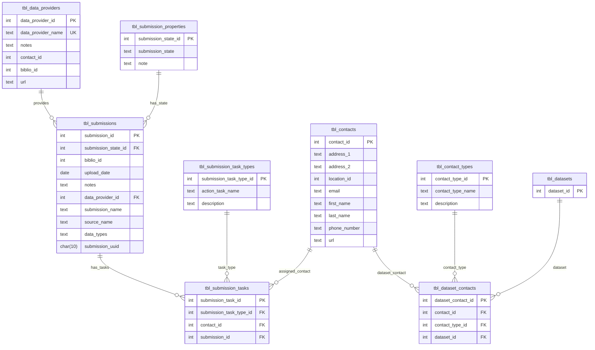

> **Archived:** This early working note is superseded by
> [REFACTOR_SEAD_SUBMISSION_METADATA.md](../proposals/CHANGE_REQUEST_INGESTER/REFACTOR_SEAD_SUBMISSION_METADATA.md)
> and the revised
> [upstream DDL](../proposals/CHANGE_REQUEST_INGESTER/20260830_DDL_SUBMISSION_MODEL_REFACTOR.sql).
> Its schema examples and ERD do not include all accepted task bibliography and event-date changes.

# An initial redesign of SEAD submission model 

The redesign introduces a 5 new tables, including `tbl_submissions` to track  submissions from data providers. The `tbl_data_providers` table is used to store information about the data providers themselves, and `tbl_submission_tasks` to track tasks associated with each submission. The other two tables are `tbl_submission_states` to define the possible states of a submission, and `tbl_submission_task_types` to define the types of tasks that can be associated with a submission.

Each dataset submission is associated with a specific data provider and can have multiple tasks linked to it, each with its own state and type. Currently, the main purpose of the submission model is to track who to contact regarding the submission and based on the associated task.

Three tables will be deprecated as part of this redesign: `tbl_dataset_masters`, `tbl_dataset_submissions`, and `tbl_dataset_submission_types`. These tables will be replaced by the new tables introduced above.

| Deprecated Table Name        | Reasoning                               |
|------------------------------|-----------------------------------------|
| tbl_dataset_masters          | Replaced by `tbl_data_providers`        |
| tbl_dataset_submissions      | Replaced by `tbl_submissions`           |
| tbl_dataset_submission_types | Replaced by `tbl_submission_task_types` |

The new tables introduced in this redesign will be initialized as follows:

| Table Name                | Initialization strategy                                                 |
|---------------------------|-------------------------------------------------------------------------|
| tbl_submissions           | Based on submissions from data providers identified by existing data    |
| tbl_data_providers        | One-to-one mapping with existing dataset masters                        |
| tbl_submission_tasks      | Rows from deprecated `tbl_dataset_submissions` (two types excluded)     |
| tbl_submission_states     | New table to define possible submission states (no legacy data exists)  |
| tbl_submission_task_types | Rows from deprecated `tbl_dataset_submission_types` (two types exluded) |

The following changes will be applied to the existing tables during the refactor:

| Table Name                   | Change Description                                 | Legacy View? |
| ---------------------------- | -------------------------------------------------- | ------------ |
| tbl_dataset_contacts         | Rows from `tbl_dataset_submissions`                | -            |
| tbl_contact_types            | Consider renaming to `tbl_dataset_contact_types`   | -            |
| tbl_dataset_masters          | Replaced by `tbl_data_providers`                   | Yes          |
| tbl_dataset_submissions      | Replaced by `tbl_submissions`                      | Yes?         |
| tbl_dataset_submission_types | Replaced by `tbl_submission_task_types`            | Yes?         |
| tbl_datasets                 | New FK submission_id referencing `tbl_submissions` | -            |

Database Schema:

# Table: tbl_submissions (new table)
```sql
create table tbl_submissions (
    submission_id int primary key, -- unique identifier for the submission
    submission_state_id int,       -- ID of the submission state (e.g., pending, approved, rejected)
    biblio_id int,                 -- ID of the bibliographic record associated with the submission
    upload_date date,              -- date when the submission was uploaded
    submission_date date,          -- date of the submission
    submission_identifier text,    -- identifier for the submission
    issue_identifier text,         -- issue identifier associated with the submission
    author text,                   -- author of the submission
    notes text,                    -- additional notes or comments about the submission
    data_provider_id int,          -- FK ID of the data provider (references tbl_data_providers)
    submission_name text,          -- name of the submission
    source_name text,              -- name of the source system or origin of the submission
    data_types text,               -- data types included in the submission (comma-separated)
    submission_uuid uuid           -- tracked entity identifier
);
```

Future improvement would be adding constraints that limits visibility of submissions based on their state, such as only allowing approved submissions to be publicly visible, or to specific user roles.

The submission states table defines the possible states that a submission can be in, such as pending, approved, or rejected.

```sql
create table tbl_submission_states (
    submission_state_id int primary key, -- unique identifier for the submission state
    submission_state text,               -- name of the submission state (e.g., pending, approved, rejected)
    note text                            -- additional notes or comments about the submission state
);
```

| Submission State ID | Submission State | Note                         |
|---------------------|------------------|------------------------------|
| 1                   | Pending          | Submission is pending review |
| 2                   | Approved         | Submission has been approved |
| 3                   | Rejected         | Submission has been rejected |

Future improvement would include adding more submission states as needed, such as "Under Review" or "Withdrawn".

# Table: tbl_data_providers (replaces existing table tbl_dataset_masters)
```sql
create table tbl_data_providers (
    data_provider_id int primary key,  -- unique identifier for the data provider
    data_provider_code text unique,    -- unique abbreviated code for the data provider
    data_provider_uuid uuid unique,    -- tracked entity identifier for the data provider
    data_provider_name text unique,    -- name of the data provider
    notes text,                        -- additional notes or comments about the data provider
    contact_id int,                    -- ID of the contact person for the data provider
    biblio_id int,                     -- ID of the bibliographic record associated with the data provider
    url text                           -- URL of the data provider's website
);
```

# Table: tbl_submission_tasks (tracks tasks associated with submissions)

Then submission tasks table tracks tasks associated with submissions, including the type of task, the responsible contact, and any relevant notes about the task. It replaces existing table `tbl_dataset_submissions`.

```sql
create table tbl_submission_tasks (
    submission_task_id int primary key,       -- unique identifier for the submission task
    submission_task_type_id int,              -- FK ID of the submission task type
    contact_id int,                           -- FK ID of the contact person responsible for the task
    submission_id int,                        -- FK ID of the submission (references tbl_submissions)
    notes text                                -- additional notes or comments about the submission task
);
```

The submission task types table replaces existing table `tbl_dataset_submission_types`:

```sql
create table tbl_submission_task_types (
    submission_task_type_id int primary key,   -- unique identifier for the submission task type
    action_task_name text,                     -- name of the action task
    description text                           -- description of the action task
);
```

The task types are migrated from existing data in table `tbl_dataset_submission_types`. Note that two types have been removed since they are related to action taken by data providers unrelated to submission tasks. These two task types are:
- 10 "Samples collected"
- 11 "Samples analysed"

| Submission Task Type ID | Description                                            |
|-------------------------|--------------------------------------------------------|
| 1                       | Original submission from data provider                 |
| 2                       | Resubmitted or revision received from data provider    |
| 3                       | Compiled into a flat file database                     |
| 5                       | Compiled into SEAD from another database               |
| 6                       | Recompiled into SEAD from another database             |
| 7                       | Compiled into SEAD from primary source                 |
| 8                       | Recompiled into SEAD or revised to SEAD                |
| 9                       | Recompiled or revised to a another relational database |
| 4                       | Compiled into another relational database              |
| 13                      | Compiled into SEAD via articles and Excel files        |
    
# Table: tbl_datasets (tracks datasets)

A new forreign key `submission_id` is added to the `tbl_datasets` table to link each dataset to its corresponding submission. This establishes a relationship between datasets and submissions, ensuring that each dataset is associated with a specific submission.

```sql
alter table tbl_datasets
add column submission_id int references tbl_submissions(submission_id);
```

# Table: tbl_dataset_contacts (tracks contacts associated with datasets)

The existing table `tbl_dataset_contacts` tracks tasks and contacts associated with the data provider's internal process for managing datasets. The following changes are proposed for this table.

Within this proposal, rows from `tbl_dataset_submissions` with submission type IDs 10 and 11 will be migrated to the `tbl_dataset_contacts`.

The mapping between submission types and dataset contacts types is as follows:

| Submission Task Type ID | Dataset Contact Type ID |
|-------------------------|-------------------------|
| 10  (Samples collected) | 4 (Samples taken by)    |
| 11  (Samples analysed)  | 2 (Analysed by)         |

Please give me a mermaid representaion of this ERD model. 

Here is a Mermaid erDiagram version based on the ERD in your image.


