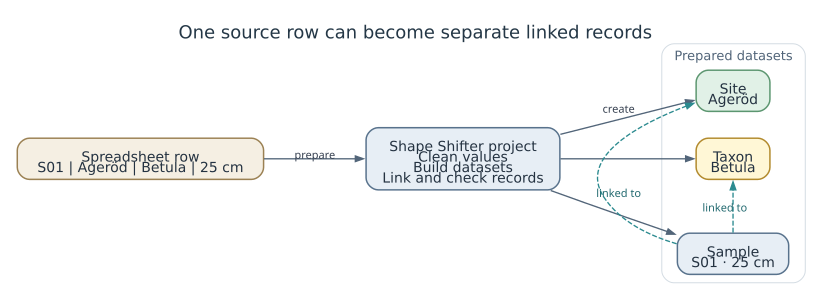
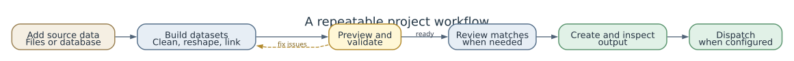

<!--
Audience: researchers, data managers, and project contributors.
The example rows are illustrative, not a SEAD schema specification.
Current Project Editor labels were checked against the Vue interface.

Export:
  marp docs/presentations/PRESENTATION_USERS.md --html
  marp docs/presentations/PRESENTATION_USERS.md --pdf
  marp docs/presentations/PRESENTATION_USERS.md --pptx
-->

<!-- _class: lead -->
<!-- _paginate: false -->

# Shape Shifter

## Prepare data for review and delivery

An introduction for researchers and data managers

**SEAD Project Team · October 2026**

---

<!-- _class: lead -->

# 1. Why Shape Shifter exists

---

## Prepare source data for its destination

| sample_code | site_name | taxon_name | depth_cm |
|-------------|-----------|------------|---------:|
| S01         | Ageröd    | Betula     |       25 |

Source files are arranged for collecting or analyzing data. A destination may need separate site, taxon, and sample records, linked to one another.

Preparing each delivery by hand makes steps harder to repeat and decisions harder to review.

---

## What Shape Shifter provides

| Need | Project feature | Result |
|------|-----------------|--------|
| Create the required datasets from source rows | Entities and transformations | Separate results for sites, samples, and related records |
| Connect records and match names | Record links and reconciliation | Relationships and reviewed matches |
| Repeat and check the work | Saved project, preview, and validation | Results others can inspect and produce again |

A project keeps source settings and preparation rules together. Accepted matches can be reused in later runs.

---

## One source row, related result datasets

---

<!-- _class: lead -->

# 2. Practical walkthrough

---

## A repeatable project workflow

---

## 1. Create a project and choose a destination

1. Open **Projects** and choose **New Project**, or open an existing project.
2. Set a project name and description.
3. In **Metadata**, select a target model when the destination has defined requirements.

A target model lists the required records, fields, and relationships. For SEAD work, use the bundled SEAD specification when it fits the project.

---

## 2. Add and inspect source data

| Source | Starting point |
|--------|----------------|
| CSV or Excel file | Upload it in **Files**, then create an entity that reads it |
| Shared database | Connect it in **Data Sources**, then select a table or query |
| Small reference list | Enter the values in a fixed entity |
| Another project result | Create an entity from the processed data |

For a database, **Schema Explorer** shows tables and columns. **Query Tester** helps inspect rows; **Create Entity from Table** provides a starting configuration.

---

## 3. Build entities for the records you need

An **entity** is one dataset in the result. A project might have one entity for sites, one for taxa, and one for samples.

Choose a source for each entity: a file, a database query, a fixed list, or another entity. Use **Basic** to set its source and fields. Use **Split View** to see settings and preview together.

---

## 4. Clean and reshape the data

| Feature | Use it to |
|---------|-----------|
| **Replace** | Trim spaces or standardize names and codes |
| **Filters** | Keep or remove rows based on a rule |
| **Unnest** | Turn several columns into repeated rows |
| **Append** | Combine compatible rows from multiple sources |
| **Extra Columns** | Add a value derived from existing data |

Preview after a change to confirm the result is what you expect.

---

## 5. Connect related records

- Choose a stable value that identifies each record, such as a sample code or site name.
- In **Foreign Keys**, link a child dataset to its parent, such as a sample to its site.
- Preview the result to check that records link to the intended parent.

The **Graph** tab shows how datasets depend on one another and can help find circular links.

---

## 6. Preview and validate

Preview a few rows and check the columns, missing values, row count, and links. In **Validate**, run:

| Check | Question |
|-------|----------|
| **Run YAML Validation** | Are the project settings and references valid? |
| **Run Data Validation** | Do the processed rows pass the configured checks? |
| **Check Conformance** | Does the result meet the selected destination requirements? |

Use sample checks while editing. Before delivery, run complete data validation and target checks when configured. Open a validation result to inspect the affected dataset.

---

## 7. Review matches to existing records

Reconciliation suggests existing destination records that may match local names, such as a site or taxon.

1. In **Reconcile**, choose the entity and target field, then run **Auto-Reconcile**.
2. In **Reconcile & Review**, inspect suggested, uncertain, and unmatched rows.
3. Correct unsuitable choices and export accepted links with **Export to Mapping**.

Accepted matches can be saved and reused on later runs. Draft choices do not change the output; manual choices take priority over saved matches.

---

## 8. Create and deliver the output

In **Execute**, choose an output format, such as CSV, Excel, or a database, then run the project and inspect the result. Keep **Run validation before execution** enabled unless there is a clear reason not to.

**Dispatch** is separate from Execute. Use it when the project has a configured target ingester and the output is ready for that workflow.

Before delivery, preview changed datasets, resolve errors, and run complete checks when configured.

---

## Save and work with others

- Use **Save Changes** to save project edits.
- If a save conflict appears, refresh and review the other changes before saving again.
- Use **Backups** to inspect or restore an earlier project version. Restoring replaces the current project YAML.
- Shared data sources are managed separately from project files.

---

## Other tools for specific needs

- **Fixed values:** keep a small reference list in the project editor.
- **Materialization:** save processed results when a source is slow or a result needs to remain available.
- **YAML:** edit settings directly when the form does not cover a configuration need.
- **Internal SQL:** query entities that the project has already processed.

These are optional. Start with the source, entities, links, and checks needed for the current delivery.

---

## First checks when something looks wrong

| Symptom | Check first |
|---------|-------------|
| Empty preview | Source file or connection, query, and filters |
| Validation error | Project structure, then the named entity and column |
| Unexpected output | Links, unnest rules, replacements, and output settings |
| Save conflict | Refresh the project and review the other changes |
| Missing matches | Reconciliation settings and service availability |

See the [User Guide](../USER_GUIDE.md) for detailed troubleshooting.

---

## Where to go next

- [User Guide](../USER_GUIDE.md): Project Editor workflows.
- [Target Model Guide](../TARGET_MODEL_GUIDE.md): destination requirements.
- [Configuration Guide](../CONFIGURATION_GUIDE.md): project settings and examples.
- [Diagrams](../DIAGRAMS.md): processing and workflow diagrams.

---

<!-- _class: lead -->
<!-- _paginate: false -->

# Shape Shifter

## Prepare, review, and deliver data
