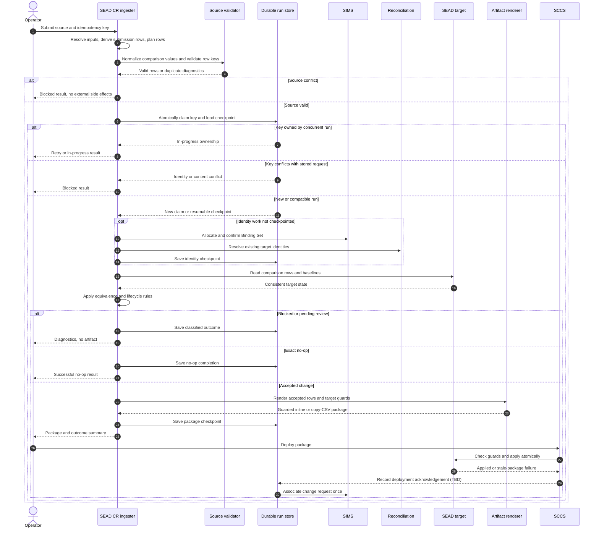
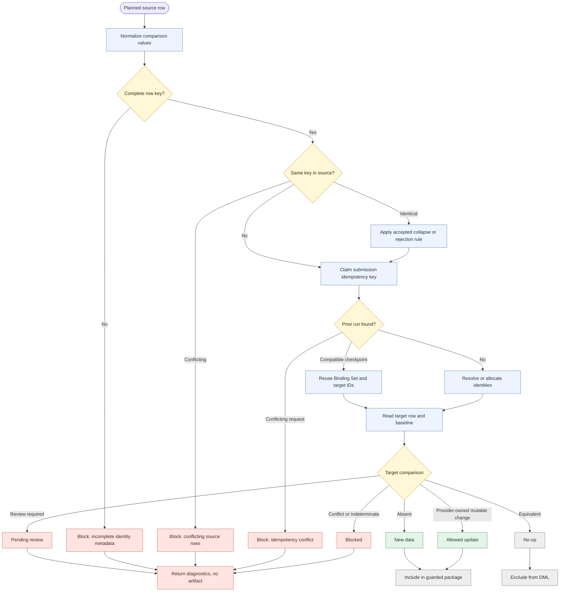
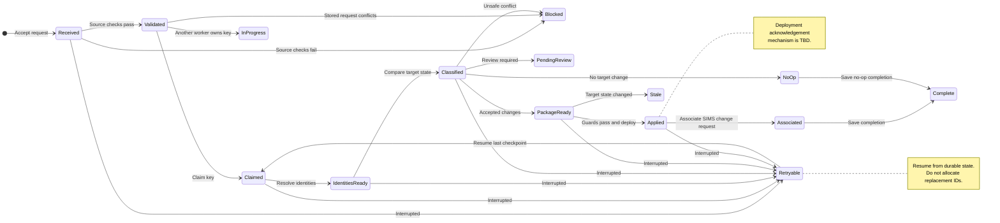

# Stronger Idempotency And Re-submission Design Diagrams

## Status

- Document type: supporting design specification
- Status: Proposed; scope and open contract decisions remain pending
- Task plan: [Stronger Idempotency And Re-submission](STRONGER_IDEMPOTENCY_AND_RESUBMISSION_TASK_PLAN.md)
- Preceding phase: [SEAD Change Request Submission Metadata](REFACTOR_SEAD_SUBMISSION_METADATA_TASK_PLAN.md)

## Purpose

These diagrams position stronger idempotency and re-submission handling within the SEAD change request ingester. They distinguish current ingester responsibilities from proposed components and show where source validation, durable run identity, prior-run lookup, target comparison, guarded artifacts, and retry handling belong.

The diagrams specify the intended design direction. Names and storage technology for the durable run store remain `TBD` until the re-submission contract is accepted.

## System Position

The change extends the existing ingester pipeline. It does not replace normalization, target-model planning, SIMS allocation, reconciliation, lifecycle policy, artifact rendering, or SCCS deployment.

```mermaid
flowchart LR
    Operator[Operator or API client]

    subgraph Existing[Existing SEAD change request ingester]
        direction LR
        Input[Resolve inputs and add submission rows]
        Plan[Plan rows from target metadata]
        Identity[Resolve identities]
        Project[Project PK and FK values]
        Collision[Check target collisions]
        Render[Render deploy artifact]
        Result[Write artifact and return result]
    end

    subgraph Proposed[Proposed idempotency extension]
        direction LR
        SourceCheck[Normalize comparison values and check duplicates]
        RunStore[Claim idempotency key and load checkpoint]
        Compare[Compare prior run and target state]
        Classify[Apply lifecycle outcomes]
        Guard[Add deployment guards]
    end

    SIMS[(SIMS)]
    Reconciliation[(Reconciliation service)]
    TargetRead[(SEAD target read model)]
    SCCS[SCCS deployment]
    TargetWrite[(SEAD target database)]

    Operator --> Input
    Input --> Plan
    Plan --> SourceCheck
    SourceCheck --> RunStore
    RunStore --> Identity
    Identity <--> SIMS
    Identity <--> Reconciliation
    Identity --> Project
    Project --> Compare
    Compare <--> TargetRead
    Compare --> Classify
    Classify --> Collision
    Collision --> Render
    Render --> Guard
    Guard --> Result
    Result --> Operator
    Operator --> SCCS
    SCCS --> TargetWrite
    TargetWrite -. deployment acknowledgement TBD .-> RunStore

    classDef existing fill:#eef4ff,stroke:#5b7db1,color:#1f2f46;
    classDef proposed fill:#fff7d6,stroke:#b58b18,color:#30270d;
    classDef external fill:#e9f6ec,stroke:#5d9a6f,color:#213629;
    classDef actor fill:#f0f0f0,stroke:#777777,color:#2f2f2f;

    class Input,Plan,Identity,Project,Collision,Render,Result existing;
    class SourceCheck,RunStore,Compare,Classify,Guard proposed;
    class SIMS,Reconciliation,TargetRead,SCCS,TargetWrite external;
    class Operator actor;
```

The proposed run store is the authority for the idempotency key, processing state, prior Binding Set, allocated target IDs, generated package identity, and external side-effect checkpoints. It must be consulted before new SIMS allocation. Target data remains authoritative for rows already deployed to SEAD.

## Proposed Request Sequence

This sequence shows the intended order for a first run, exact rerun, compatible retry, or conflicting reuse. Source validation and the idempotency claim occur before external identity work.

The deployment acknowledgement mechanism is unresolved. It must use an existing SCCS, API, or operator workflow and must not require an unplanned change to SCCS internals.

## Row Classification Activity

Source duplicates and target overlap are different checks. Source duplicate handling prevents unnecessary external identity work. Target comparison determines whether a valid row is new, unchanged, update-eligible, review-routed, or blocked.

Target-ID presence is only a comparison candidate. It does not by itself prove that a row is unchanged or authorize an update.

## Durable Run State

The run store must preserve enough state to resume after interruption without repeating completed identity or association side effects. State names may change when the storage contract is accepted, but the transitions and checkpoints are required.

`Blocked` and `Stale` require a corrected request or a fresh preflight. `PendingReview` resumes only after the existing lifecycle review process allows it. `Retryable` resumes from the last durable checkpoint rather than restarting all work.

## Design Constraints

- Existing lifecycle outcomes remain authoritative: `new_data`, `no_op`, `allowed_update`, `pending_review`, and `blocked`.
- Source duplicate checks complete before SIMS allocation, Binding Set mutation, or change-request association.
- A compatible retry reuses its prior Binding Set and target-ID assignments.
- Concurrent requests for one idempotency key cannot allocate or apply independently.
- Inline INSERT and copy-CSV packages use the same row plan and equivalent deployment guards.
- Target-state guard failure is atomic and produces a stale-package result rather than partial target writes.
- SIMS change-request association occurs once at the accepted completion point.
- The design does not add functional rollback or change SCCS internals.

## Open Design Decisions

The task plan tracks the decisions that must be resolved before implementation. The diagrams depend most directly on:

1. The stable idempotency key and content-equivalence rules.
2. The authoritative durable run store and retention period.
3. The exact durable state names and ownership or lease mechanism.
4. The all-no-op result form.
5. The deployment guard representation for inline and copy-CSV packages.
6. The deployment acknowledgement that marks a package as applied before one-time SIMS association.