# Proposal: SEAD Change Request Ingester

## Status

- Accepted feature
- Scope: New SEAD-targeted ingester that emits SEAD Change Control System change requests directly from normalized DataFrames
- Goal: Replace the Clearinghouse plus Transport System path with a simpler, identity-aware, implementation-ready workflow

## Summary

Replace the current SEAD Clearinghouse ingester with a new ingester that generates SEAD Change Control System-ready SQL directly from normalized DataFrames. The new ingester resolves identities before SQL generation by using SIMS for provider-owned entities and for classifier entities that require Delivery 1 allocation, while still using the existing reconciliation API where matching existing SEAD-managed entities is appropriate.

The recommendation was to deliver this in two stages. Delivery 1 is now closed on the current MVP baseline: forward-only, INSERT-only, no rollback support, no UPDATE handling, and no dependency on topological insert order if the target constraints can be deferred.

This keeps the first delivery small enough to implement and validate while still removing the Clearinghouse staging layer and the Transport System from the main ingestion path.

Post-Delivery-1 hardening is now tracked separately in [./DELIVERY_1_FOLLOWUP_CR.md](./DELIVERY_1_FOLLOWUP_CR.md).

Candidate next-delivery capabilities are tracked in [../NEXT_DELIVERY_CANDIDATES.md](../../NEXT_DELIVERY_CANDIDATES.md), and frontend workflow integration is tracked separately in [../FRONTEND_UX_INTEGRATION_CR.md](../../FRONTEND_UX_INTEGRATION_CR.md).

## Problem

The current SEAD ingester produces a Clearinghouse submission rather than a SEAD Change Control System change request.

```
Normalized DataFrames -> CSV files -> Clearinghouse staging tables -> stored procedures -> public schema
```

That path has five practical problems.

1. It is indirect. DataFrames are serialized to CSV, then reloaded into PostgreSQL, then copied into public tables.
2. It has weak identity handling. New versus existing rows are inferred from `public_id`, but there is no formal identity lifecycle or durable binding.
3. It is not change-control native. The Change Control System is reached only through the Transport System.
4. It is tightly coupled to legacy Clearinghouse tables and stored procedures.
5. It has weak idempotency. Re-running a submission can create duplicates or produce unclear outcomes.

SIMS addresses identity resolution, but the current ingestion path does not use it end to end. This proposal closes that gap.

## Scope

This proposal covers:

- A new ingester registered alongside the existing `sead` ingester
- A DataFrame-first ingester contract for SEAD change-package generation
- Identity resolution for provider-owned entities via `SimsClient`
- Matching of SEAD-managed entities via the existing reconciliation API and `ReconciliationClient`
- Resolution of foreign keys from local `system_id` values to resolved SEAD integer IDs
- Generation of SEAD Change Control System SQL DML artifacts from normalized DataFrames
- Binding Set confirmation and change request association in SIMS
- A two-delivery plan, with a strict MVP in Delivery 1

## Non-Goals

- Modifying the Shape Shifter core pipeline
- Modifying SIMS internals
- Generating DDL
- Writing directly to the SEAD database from Shape Shifter
- Replacing CSV or Excel dispatchers for non-SEAD targets
- Solving rollback, UPDATE support, or advanced change detection in Delivery 1

## Current Behavior

The current end-to-end path is:

```
Data provider data + project YAML
    -> Shape Shifter normalization
    -> SEAD-formatted output
    -> Clearinghouse ingester
    -> Transport System
    -> SEAD Change Control System
    -> SEAD database
```

The current `ingesters/sead/` path still depends on:

- CSV generation
- Clearinghouse staging tables
- Stored procedures that explode staged content into public tables
- Manual or implicit handling of new versus existing identities

The following building blocks already exist and can be reused.

| Component                                     | Reuse                                                                                   |
|-----------------------------------------------|-----------------------------------------------------------------------------------------|
| SIMS and `SimsClient`                         | Resolve provider-owned entities, allocate IDs, confirm Binding Sets, associate CR names |
| Reconciliation API and `ReconciliationClient` | Match SEAD-managed entities that must already exist                                     |
| Target model metadata                         | Drive table names, identity columns, public IDs, and FK definitions                     |
| Target-model validators                       | Ensure normalized DataFrames conform before ingestion                                   |
| Existing ingester framework                   | Registration, discovery, and configuration                                              |

What did not yet exist at proposal time was the ingester-specific orchestration for turning resolved DataFrames into Change Control System artifacts. That Delivery 1 orchestration is now implemented on the current baseline.

### Upstream SIMS contract dependency

The proposal originally depended on SIMS returning target-facing integer IDs through `ResolutionOutcome.target_id`.

That upstream dependency is now satisfied on the current Delivery 1 baseline. The backend `SimsClient` and the ingester runtime adapter consume `target_id` for SIMS-backed materialization, and the Delivery 1 bridge path is also implemented through the real backend runtime seam.

## Proposed Design

### Core rule

No SQL is generated until all required identities are resolved.

That means:

- Every row that will appear in output SQL has a resolved Delivery 1 identity state and any required target-facing SEAD integer IDs
- Every foreign key in output SQL points to a resolved SEAD integer ID
- The resolved identities are captured in a confirmed SIMS Binding Set, or the run fails before emitting SQL

If any required identity cannot be resolved, the ingester aborts with diagnostics. No partial change request is emitted.

For Delivery 1, row planning and identity resolution must distinguish at least these states:

| Case | Meaning | SQL behavior |
|------|---------|--------------|
| Existing entity | `public_id` maps to a current target row | Reference only, no entity insert |
| Newly allocated entity | SIMS allocated and bound a new target ID | Insert |
| Reconciled classifier | Reconciliation matched an existing target row | Reference only, no insert |
| Derived bridge row | Row identity is derived from already resolved parent IDs and its own uniqueness rule | Insert only if absent |
| Blocked unresolved | Required SIMS allocation, reconciliation match, bridge uniqueness rule, or Binding Set confirmation is missing | No SQL emission; fail the run with diagnostics |

Delivery 1 should treat these as distinct planning states, not as one generic "resolved ID" bucket. That distinction controls whether a row is inserted, referenced only, checked for bridge-row absence before insertion, or blocks the run before any SQL is emitted.

### Delivery 1 Interaction Flow

```mermaid
flowchart LR
    A[Normalized DataFrame bundle] --> B[sead_change_request ingester]
    C[Target model metadata] --> B
    D[Submission context and config] --> B

    B --> E[Row planning and state classification]
    E --> F[SIMS allocation and Binding Set]
    E --> G[Reconciliation matching]

    F --> H{Confirmation complete?}
    G --> E
    H -->|No| I[Pending confirmation report]
    H -->|Yes| J[PK and FK materialization]

    J --> K[Target DB collision checks]
    K --> L{Blocked or colliding rows?}
    L -->|Yes| M[Diagnostics and no artifacts]
    L -->|No| N[Deploy SQL and package metadata]

    N --> O[SIMS CR association]
    O --> P[Change package]

    classDef input fill:#eef4ff,stroke:#5b7db1,color:#1f2f46;
    classDef process fill:#f7f4ea,stroke:#9e8a53,color:#3b3320;
    classDef external fill:#e9f6ec,stroke:#5d9a6f,color:#213629;
    classDef decision fill:#fff7d6,stroke:#d6a300,color:#2b2b2b;
    classDef blocked fill:#ffe4e1,stroke:#cc6b5a,color:#4a1f1a;
    classDef output fill:#ececec,stroke:#7f7f7f,color:#2f2f2f;

    class A,C,D input;
    class B,E,J,N process;
    class F,G,K,O external;
    class H,L decision;
    class I,M blocked;
    class P output;
```



### Delivery 1: MVP

Delivery 1 was intentionally narrow and is now closed on that basis.

#### Delivery 1 goals

- Generate a forward-only SEAD change request from normalized DataFrames
- Use SIMS and reconciliation before SQL generation
- Treat rows with populated `public_id` as existing target entity rows
- Evaluate bridge and association rows independently using their own identity or composite uniqueness rule
- Insert only rows that are new to the target system
- Abort on ambiguity or collision rather than trying to repair or merge data

#### Delivery 1 non-goals

- Rollback support
- UPDATE statements
- Delete handling
- Automatic repair of unresolved classifier matches
- Sophisticated change detection
- Complex ordering logic if deferred FK checks are sufficient

#### Delivery 1 flow

1. Receive a normalized DataFrame bundle, target model, submission context, and ingester config through the ingester handoff contract.
2. Load target model metadata for entity role, target table, public ID column, and FK definitions.
3. Partition entity rows into two groups:
    - existing entity rows: `public_id` already populated
    - new entity rows: `public_id` missing and therefore candidates for insertion
4. Evaluate bridge and association rows independently from entity rows using their own identity or composite uniqueness rule.
5. Build identity requests for new provider-owned rows, any classifier rows that require Delivery 1 allocation, and reconciliation requests for rows expected to match existing SEAD-managed entities.
6. Resolve each planned row into an explicit Delivery 1 state: existing entity, newly allocated entity, reconciled classifier, derived bridge row, or blocked unresolved.
7. Confirm the Binding Set inside the same Delivery 1 run. Delivery 1 is synchronous at the change-package boundary: if manual confirmation is required and cannot be completed during the run, mark affected rows as blocked unresolved, stop before SQL generation, and emit diagnostics plus a pending confirmation report rather than a partial change package.
8. Replace local `system_id` references with resolved SEAD integer IDs in both PK and FK positions.
9. Run a limited idempotency pre-flight check against the target system for all rows that will be inserted. If any newly allocated target ID already exists, or any derived bridge row is already present under its metadata-defined uniqueness rule, abort the change request and report the collision set.
10. Emit forward-only deploy SQL only for rows whose resolved state requires insertion.
11. Associate the generated change request name with the confirmed Binding Set.

#### Delivery 1 SQL strategy

Delivery 1 should prefer the simplest safe SQL strategy.

- Generate `INSERT` statements only.
- Wrap the change set in a single transaction.
- Use deferred FK checks instead of enforcing a specific insert order, if the target schema supports that.
- Exclude entity rows already marked as existing through `public_id`.
- Evaluate bridge and association rows independently before excluding them from output.
- Exclude reconciled classifier rows from `INSERT` generation while still using their resolved IDs in FK positions.
- Treat blocked unresolved rows as hard failures that prevent any SQL emission.
- Treat Delivery 1 idempotency as limited to target ID collision detection and explicit bridge uniqueness checks, not as general semantic duplicate detection.
- Fail the whole generation if a new row collides with existing target data.

This keeps the first delivery aligned with current SEAD practice, where releases are applied forward from an empty or controlled baseline and rollback is not part of the normal workflow.

#### Delivery 1 output

Delivery 1 should produce the minimum artifact set required by the SEAD Change Control System.

At minimum:

- deploy SQL
- metadata linking submission, project, timestamp, Binding Set UUID, and non-revertible Delivery 1 status
- a CR name associated in SIMS

If the Change Control System requires a revert or verify file to accept a change, Delivery 1 may generate compatibility placeholders only under a strict non-revertible contract. Any placeholder revert script must fail loudly with an explicit message that rollback is not implemented for the change package. Delivery metadata must mark the package as non-revertible. Workflow acceptance of that placeholder artifact shape is now treated as post-Delivery-1 hardening in [./DELIVERY_1_FOLLOWUP_CR.md](./DELIVERY_1_FOLLOWUP_CR.md). Functional rollback is deferred beyond this closed baseline.

The current Delivery 1 artifact shape follows that compatibility rule. It emits `deploy.sql`, `revert.sql`, `verify.sql`, and `metadata.json`. The revert and verify files are explicit fail-loud placeholders, and the metadata marks the package as non-revertible and verification-placeholder based.

Further work on alternative deploy formats, templating, and target-model review is now tracked in [./DELIVERY_1_FOLLOWUP_CR.md](./DELIVERY_1_FOLLOWUP_CR.md) rather than inside this proposal.

If Binding Set confirmation cannot be completed during the run, Delivery 1 should emit no change package. Instead it should return diagnostics and a pending confirmation report that identifies the blocked rows, the outstanding confirmation step, and the exact operator action needed to rerun successfully.

### Post-Delivery-1 follow-up

This closed baseline no longer defines a committed Delivery 2 scope.

Candidate next-delivery capabilities now live in [../NEXT_DELIVERY_CANDIDATES.md](../../NEXT_DELIVERY_CANDIDATES.md). User-interaction and frontend workflow requirements now live in [../FRONTEND_UX_INTEGRATION_CR.md](../../FRONTEND_UX_INTEGRATION_CR.md).

### Entity handling by role

| Role         | Delivery 1 behavior                                                                                             |
|--------------|-----------------------------------------------------------------------------------------------------------------|
| `fact`       | Provider-owned. Resolve through SIMS. Insert if new.                                                            |
| `lookup`     | Provider-owned. Resolve through SIMS. Insert if new.                                                            |
| `classifier` | Reconcile to an existing SEAD entity when possible. If no match exists, Delivery 1 may allocate through SIMS and insert the classifier row. |
| `bridge`     | Derived from already resolved parent identities. Evaluate independently from parent `public_id` state and insert if new under metadata-defined uniqueness rules where available. |

Classifier entities that cannot be matched are a hard failure in Delivery 1.

### Identity model alignment

The ingester bridges Shape Shifter's identity tiers as follows.

```
system_id -> identity resolution -> Delivery 1 resolved state -> SQL PK/FK values and insert decisions
            ^
            keys, public_id, reconciliation signals, and bridge uniqueness rules
```

After resolution:

- `system_id` stays internal to the normalization process
- At ingester input time, a populated `public_id` marks an entity row as already existing in the target system
- Bridge and association rows are evaluated separately from entity-row `public_id` state
- Newly allocated provider-owned or classifier rows receive target-facing IDs that are then used in generated SQL
- Reconciled classifier rows contribute target-facing IDs for references but do not produce entity inserts
- Derived bridge rows use resolved parent IDs plus metadata-defined uniqueness rules, where available, to decide whether they produce inserts
- Blocked unresolved rows stop the run before SQL generation and are reported with actionable diagnostics
- Output SQL contains only target-facing integer IDs in emitted PK and FK positions

### Registration and transition

The new ingester should be registered under the key `sead_change_request` and developed alongside the existing `sead` ingester.

Transition plan:

1. Keep both ingesters available during implementation and pilot use.
2. Validate the new ingester on real projects.
3. Keep post-Delivery-1 hardening in the separate follow-up CR.
4. Deprecate the Clearinghouse path only after the next-delivery scope is accepted, the required frontend UX integration is in place, and the replacement path is operationally preferred.

## Alternatives Considered

### Keep the Clearinghouse path and improve it

Rejected for now. It preserves the current indirection and does not move SEAD ingestion onto an identity-aware, change-control-native path.

### Build the full rollback and UPDATE solution first

Rejected for Delivery 1. It increases design and testing scope before the basic end-to-end path is proven.

### Enforce topological insert order from the start

Deferred. It should only be required if deferred FK checks are not sufficient in the target schema.

## Risks And Tradeoffs

| Risk                                                                  | Impact                                 | Mitigation                                                                      |
|-----------------------------------------------------------------------|----------------------------------------|---------------------------------------------------------------------------------|
| SIMS or reconciliation API unavailable                                | No CR can be generated                 | Fail fast with clear diagnostics; keep old ingester available during transition |
| Target schema does not support deferred FK checks everywhere          | Delivery 1 SQL may fail                | Validate target constraints early; fall back to ordered inserts if required     |
| Entity or bridge rows are classified with the wrong new-versus-existing rule | Duplicate inserts, missed associations, or collisions | Separate entity-row `public_id` handling from bridge uniqueness checks, use metadata-defined unique/composite keys where available, and fail when uniqueness rules are incomplete |
| Delivery 1 idempotency is mistaken for semantic deduplication | Natural-key or composite-key duplicates may still slip through | State the Delivery 1 limit explicitly and defer broader duplicate detection to later-delivery candidate work |
| Placeholder revert artifacts are mistaken for functional rollback     | Operators may assume a rollback path exists when it does not | Make revert placeholders fail loudly, mark Delivery 1 packages as non-revertible, and confirm operator acceptance in the pilot |
| Binding Set confirmation requires operator action outside the run | Change package generation may stall or produce ambiguous state | Keep Delivery 1 synchronous, emit a pending confirmation report instead of partial artifacts, and require an explicit rerun after confirmation |
| Classifier reconciliation or allocation rules are misapplied         | Wrong classifier inserts or blocked submissions | Prefer reconciliation first, allow Delivery 1 SIMS allocation, and surface which path was chosen in diagnostics |
| Change Control System has stricter artifact requirements than assumed | Delivery 1 packaging may be incomplete | Confirm deploy/revert/verify expectations before implementation starts          |

The main tradeoff is deliberate scope reduction in Delivery 1. The MVP will not handle every operational case, but it will prove the direct path and the identity model with much lower implementation risk.

## Testing And Validation

### Delivery 1

- Unit tests for identity request construction from normalized DataFrames
- Unit tests for Delivery 1 identity-state classification per row
- Unit tests for blocked-unresolved rows caused by missing allocation, incomplete classifier resolution, or incomplete Binding Set confirmation
- Unit tests for PK and FK replacement from `system_id` to resolved target IDs
- Unit tests for INSERT SQL generation and transaction wrapper generation
- Unit tests for exclusion of existing entity rows with populated `public_id`
- Unit tests for exclusion of reconciled classifier rows from entity-table inserts
- Unit tests for bridge and association row evaluation using metadata-defined unique or composite keys where available
- Unit tests for collision detection against target-side existing IDs
- Unit tests that document Delivery 1 idempotency limits for natural-key and composite-key duplicates
- Unit tests for placeholder revert artifacts that fail loudly and mark the package as non-revertible
- Integration test for Binding Set confirmation blocking that emits a pending confirmation report and no SQL artifacts
- Integration test for end-to-end flow: normalized DataFrames -> identity resolution -> deploy SQL output
- Integration test covering both reconciled and SIMS-allocated classifier paths
- Pilot run on a real project with review of generated SQL, SIMS Binding Set data, and at least one mixed submission containing existing references, new provider-owned entities, classifiers, and bridge rows

Later-delivery validation work is now tracked as candidate scope in [../NEXT_DELIVERY_CANDIDATES.md](../../NEXT_DELIVERY_CANDIDATES.md), not as committed acceptance work in this closed baseline.

## Acceptance Criteria

### Delivery 1

Delivery 1 is closed on the implemented MVP baseline.

Remaining operator-facing artifact hardening, alternative deploy formats, and metadata-review work now live in [./DELIVERY_1_FOLLOWUP_CR.md](./DELIVERY_1_FOLLOWUP_CR.md).

- [x] A new ingester is registered and can be selected without affecting the current `sead` ingester
- [x] All rows selected for output have an explicit Delivery 1 identity state before SQL generation starts
- [x] Resolved target-facing IDs are projected into the target identity columns and FK positions required for Delivery 1 output
- [x] Entity rows with populated `public_id` are treated as existing and are not inserted again
- [x] Existing entity rows may be referenced by new bridge or association rows without re-inserting the existing entity rows
- [x] Reconciled classifier rows are reference-only and are not inserted again
- [x] Unmatched classifier rows may be allocated through SIMS in Delivery 1 and inserted when allocation succeeds
- [x] Blocked unresolved rows stop the run before SQL generation and produce actionable diagnostics
- [x] Bridge and association rows have an explicit identity or uniqueness rule and are emitted when they are new under that rule
- [x] New rows are emitted as `INSERT` statements only
- [x] The ingester exposes a documented DataFrame-first handoff contract or adapter boundary
- [x] Collision diagnostics include primary-key collisions and, where metadata exists, matching composite, unique, or natural-key collisions used by bridge-table decisions
- [x] Delivery 1 idempotency is explicitly limited to target ID collision detection and defined bridge uniqueness checks
- [x] Classifier rows that can neither reconcile nor allocate stop the run with clear diagnostics
- [x] A confirmed Binding Set exists before the change request is finalized
- [x] Binding Set confirmation behavior is documented for both automatic confirmation and manual-confirmation blocking cases
- [x] The generated CR name is associated with the Binding Set in SIMS
- [x] Any required Delivery 1 revert placeholder fails explicitly and the change metadata marks the package as non-revertible
- [x] The pilot includes at least one mixed submission containing existing references, new provider-owned entities, classifiers, and bridge rows
- [x] Delivery 1 closes on the documented inline-`INSERT` artifact baseline; operator-facing artifact hardening and SEAD workflow acceptance move to [./DELIVERY_1_FOLLOWUP_CR.md](./DELIVERY_1_FOLLOWUP_CR.md)

Closure note as of 2026-05-26:

- The authority-service `ResolutionOutcome.target_id` contract is now implemented, and Shape Shifter consumes it when present.
- Delivery 1 is now treated as closed on the current MVP baseline described in this proposal.
- Post-Delivery-1 work on operator-facing artifact hardening, alternative deploy formats, and metadata-source review is tracked in [./DELIVERY_1_FOLLOWUP_CR.md](./DELIVERY_1_FOLLOWUP_CR.md).

- Candidate next-delivery capabilities are tracked separately in [../NEXT_DELIVERY_CANDIDATES.md](../../NEXT_DELIVERY_CANDIDATES.md).

- Frontend workflow integration is tracked separately in [../FRONTEND_UX_INTEGRATION_CR.md](../../FRONTEND_UX_INTEGRATION_CR.md).

## Resolved Delivery 1 Decisions

### 1. Change request artifact contract

Delivery 1 should generate a Sqitch-style change package with these artifacts:

- an executable `deploy/...` SQL script
- a placeholder `revert/...` script that fails loudly and clearly states rollback is not yet implemented
- a placeholder `verify/...` script if the SEAD Change Control workflow requires file presence for a valid change package

Delivery 1 metadata must also mark the package as non-revertible so operators are not given false confidence by file presence alone.

This keeps Delivery 1 compatible with the existing change-request naming convention already used by SIMS, where associated change requests are recorded as `deploy/...` paths, while still deferring functional rollback beyond this closed baseline. Real SEAD workflow acceptance of the fail-loud placeholder artifact shape is now tracked as post-Delivery-1 hardening in [./DELIVERY_1_FOLLOWUP_CR.md](./DELIVERY_1_FOLLOWUP_CR.md).

### 2. Foreign key execution strategy

Delivery 1 should assume deferred foreign key checks inside a single transaction.

This is the preferred path because it keeps the first implementation simple and avoids building insert-order logic up front. The implementation must still validate this assumption against the target schema during early delivery work. If any required target constraint is not deferrable, the fallback is deterministic topological insert ordering for the affected tables. That fallback belongs inside Delivery 1 implementation and does not require a separate product decision.

### 3. Target-side collision checks

Delivery 1 should perform collision checks through a direct, read-only connection to the target database.

This is the simplest fit with the current ingester architecture:

- `IngesterConfig` already carries database connection settings
- the current `sead` ingester already connects directly to PostgreSQL
- introducing a new validation endpoint or proxy service would add another dependency without reducing MVP risk

The Delivery 1 collision check should stay narrow: for each row planned for insertion, verify that either the resolved target-facing ID does not already exist in the target table or, for derived bridge rows, that the bridge row is absent under metadata-defined unique or composite keys where that metadata exists. If the target metadata does not define a usable bridge uniqueness rule, the row becomes blocked unresolved and the run must stop with diagnostics rather than guess. Delivery 1 idempotency is therefore limited to target ID collision detection and explicit bridge uniqueness checks. It does not guarantee semantic duplicate detection across natural keys, lookup-like rows, or broader composite relationship keys beyond what target metadata explicitly exposes. More advanced change detection remains later-delivery candidate work.

### 4. Existing entities versus bridge and association rows

Delivery 1 should exclude existing entity rows from entity-table inserts, but it must still evaluate bridge and association rows independently.

This rule is required before Issue 3 and Issue 5 because parent rows may already exist while the relationship rows derived from them are still new. A populated entity `public_id` is therefore not sufficient to exclude all downstream rows from SQL generation.

For Delivery 1:

- entity tables use populated `public_id` to identify rows that already exist and should not be inserted again
- bridge and association tables use metadata-defined identity, unique, or composite-key rules to decide whether a row is new when that metadata exists
- if the required uniqueness rule for a bridge or association table is not defined well enough to evaluate safely, the row becomes blocked unresolved and the ingester must stop with diagnostics rather than guess

### 5. Resolved identity states

Delivery 1 should define resolved identity states strictly enough to drive SQL behavior without inference.

For Delivery 1:

- existing entity means a populated `public_id` or equivalent lookup identifies a current target row, so the row is reference-only and does not generate an entity insert
- newly allocated entity means SIMS has allocated and bound a new target-facing ID, so the row is eligible for insertion
- reconciled classifier means reconciliation matched an existing target row, so the row is reference-only and does not generate an insert
- derived bridge row means the row is defined by resolved parent IDs plus metadata-defined unique or composite-key rules, so it is inserted only if absent
- blocked unresolved means a required identity step, uniqueness rule, or Binding Set confirmation step is missing, so the row prevents SQL generation and must be reported for operator action

The implementation must carry this state explicitly through planning and SQL generation. It must not infer insert behavior from the presence of a target ID alone.

### 6. Binding Set confirmation flow

Delivery 1 should be synchronous at the change-package boundary.

For Delivery 1:

- if SIMS confirmation can be completed during the run, the ingester continues and may generate a change package
- if SIMS indicates that manual confirmation is required and that confirmation is not completed during the run, the ingester must not generate deploy, revert, or verify artifacts
- in that blocked case, affected rows are marked blocked unresolved and the ingester returns a pending confirmation report with Binding Set identifiers, blocked entities, and rerun instructions
- Delivery 1 does not support resume-in-place; the operator completes confirmation externally and reruns the ingester from the start

This keeps the MVP simple, avoids partial artifact state, and makes operator workflow explicit without adding long-lived orchestration in Delivery 1.

### 7. Classifier allocation rule

Delivery 1 should allow classifier entities to be allocated through SIMS.

For Delivery 1:

- classifier resolution should try reconciliation first when an existing SEAD classifier is expected
- if reconciliation does not yield a match, the ingester may allocate the classifier through SIMS and treat it as a newly allocated entity
- allocated classifier rows follow the same insert path as other newly allocated rows
- if a classifier row can neither reconcile nor allocate successfully, it becomes blocked unresolved and the run stops with diagnostics

### 8. Source handoff contract

Delivery 1 should use an explicit DataFrame-first ingester contract rather than quietly depending on the legacy path-based Excel or CSV workflow.

The recommended contract is:

```python
SeadCrIngester.ingest(
    frames: Mapping[str, pandas.DataFrame],
    target_model: TargetModel,
    submission_context: SubmissionContext,
    config: IngesterConfig,
) -> ChangePackage
```

For Delivery 1 this means:

- `frames` is the authoritative normalized table bundle produced by the core pipeline
- `target_model` carries the metadata needed for entity roles, table names, identity columns, and foreign keys
- `submission_context` carries run metadata required for CR naming, audit, project linkage, and SIMS association
- `config` carries ingester configuration including read-only target DB access and service endpoints
- `ChangePackage` is the ingester output boundary and contains the generated deploy artifacts plus required metadata

If the existing ingester framework still needs a path-based entry point, that compatibility layer should be a thin adapter outside the core SEAD change-request orchestration:

```text
normalized artifact path -> loader -> DataFrame bundle -> SeadCrIngester.ingest(...)
```

The orchestration logic in this proposal should depend on the DataFrame-first contract, not on file paths, CSV layouts, or the legacy Excel dispatch flow.

### 9. Delivery 1 new-row rule and ingester key

Delivery 1 should use missing `public_id` only as the rule for deciding whether an entity row is new.

For Delivery 1:

- an entity row with populated `public_id` is treated as existing and is not inserted again
- an entity row with missing `public_id` is treated as new and proceeds to identity resolution and insertion checks
- target-side collision checks remain a safety check, not part of the definition of newness
- the ingester key should be `sead_change_request`
- the naming convention for generated DML artifacts should be specified by the user or operator context rather than fixed in this proposal

## Implementation Handoff

The Delivery 1 work can be broken into these implementation issues.

### Issue 1. Scaffold the new ingester

Scope:

- Add a new ingester package under `ingesters/sead_change_request/`
- Register it under the key `sead_change_request`
- Add metadata, validation stub, and ingestion entry point

Done when:

- The ingester appears in registry-backed API and CLI listings
- It can be instantiated through the existing `IngesterService`

### Issue 2. Decide and implement the source handoff contract

Scope:

- Implement the DataFrame-first handoff contract for the new ingester
- Define the `SubmissionContext` and `ChangePackage` boundary types required by that contract
- If needed for framework compatibility, add a thin adapter from a path-based entry point into the DataFrame bundle used by the ingester core

Done when:

- The new ingester can receive the normalized data it needs without hidden coupling to the old Excel workflow
- The DataFrame-first contract is documented in code and tests
- Any path-based compatibility layer is explicitly limited to adaptation rather than orchestration

### Issue 3. Build target model extraction and row partitioning

Scope:

- Read target metadata needed for table names, public ID columns, roles, and foreign keys
- Partition entity rows into existing versus new using `public_id`
- Define and apply bridge and association uniqueness rules separately from entity-row partitioning
- Identify which entities need SIMS allocation, reconciliation, or derived bridge handling

Done when:

- The ingester can produce a deterministic per-entity work plan from normalized DataFrames
- The work plan distinguishes entity-row exclusion from bridge and association row emission

### Issue 4. Implement identity orchestration

Scope:

- Build SIMS resolution requests for provider-owned rows
- Reuse reconciliation for classifier rows that already exist and fall back to SIMS allocation for classifier rows that need Delivery 1 creation
- Classify each planned output row into an explicit Delivery 1 identity state
- Confirm Binding Set status before SQL generation continues and convert incomplete confirmation into blocked-unresolved rows plus a pending confirmation report

Done when:

- Every row selected for SQL emission has a resolved Delivery 1 identity state and any required target-facing IDs
- Manual-confirmation cases produce a pending confirmation report and no SQL artifacts
- Classifier rows that can neither reconcile nor allocate fail with actionable diagnostics

### Issue 5. Materialize PK and FK values

Scope:

- Replace local `system_id` values with resolved SEAD IDs
- Support bridge rows derived from already resolved parent identities
- Apply insert-versus-reference behavior from the resolved identity state rather than from ID presence alone

Done when:

- Output-ready rows contain only target-facing integer IDs in PK and FK positions
- Reference-only rows are excluded from entity-table `INSERT` generation while still supplying resolved FK values where needed
- No local `system_id` values remain in generated SQL inputs

### Issue 6. Implement Delivery 1 collision checks

Scope:

- Add direct read-only target DB lookups for rows planned for insertion
- Abort on duplicate target IDs or pre-existing bridge rows before SQL generation
- Use metadata-defined unique or composite keys for bridge-row checks where that metadata exists
- Document the Delivery 1 idempotency boundary so callers do not assume semantic duplicate detection

Done when:

- The ingester fails fast on duplicate target IDs or pre-existing bridge rows
- Collision diagnostics identify table and ID set or bridge uniqueness key clearly
- The implementation and operator-facing output make the limited idempotency guarantee explicit

### Issue 7. Generate Delivery 1 SQL artifacts

Scope:

- Generate forward-only `INSERT` SQL in a single transaction
- Use deferred FK checks where available, with ordered inserts as fallback if needed
- Package deploy and any required placeholder revert or verify artifacts under an explicit non-revertible contract

Done when:

- The generated artifact set can be reviewed and executed through the SEAD Change Control workflow
- Any required revert placeholder fails loudly and the package metadata marks the change as non-revertible

### Issue 8. Associate the change request in SIMS

Scope:

- Associate the generated CR name with the confirmed Binding Set
- Persist submission metadata needed for audit and traceability

Done when:

- A generated change package can be traced back to its Binding Set and submission context

### Issue 9. Validate with tests and a pilot submission

Scope:

- Add unit coverage for row partitioning, identity planning, FK replacement, collision detection, and SQL generation
- Add integration coverage for the identity-resolution-to-SQL path
- Run one pilot against real project data, confirm operator acceptance of the non-revertible placeholder artifact contract if placeholder files are required, and exercise at least one manual-confirmation block scenario plus one mixed submission with existing references and bridge rows

Done when:

- Delivery 1 acceptance criteria pass
- The pilot confirms the artifact contract, including non-revertible placeholder behavior if used, and exposes the concrete later-delivery gaps

## Recommended Delivery Order

1. Scaffold the new ingester under a new key.
2. Implement the explicit DataFrame-first source handoff contract.
3. Build target model extraction and row partitioning.
4. Implement identity and reconciliation orchestration.
5. Implement PK and FK replacement using resolved SEAD IDs.
6. Implement Delivery 1 target-side collision checks.
7. Implement forward-only INSERT SQL generation and CR packaging.
8. Validate deferred-FK assumptions and fall back to ordered inserts if required.
9. Associate the CR name with the Binding Set.
10. Pilot on real project data and use findings to define the next delivery precisely.

## Open Questions

1. What user-facing naming convention should be used for generated DML or change request artifacts in Delivery 1?

## Final Recommendation

Build the new ingester alongside the current `sead` ingester and treat Delivery 1 as a constrained MVP, not as the full end state. Delivery 1 should be forward-only and INSERT-only, should rely on SIMS and reconciliation to resolve all identities before SQL generation, should allow classifier entities to reconcile first and allocate through SIMS when needed, should use an explicit DataFrame-first handoff contract into the ingester core, should treat populated `public_id` values as existing entity rows rather than as a blanket exclusion rule, should treat missing `public_id` only as the rule for entity-row newness, should register the ingester under `sead_change_request`, and should use a direct read-only target DB check for simple collision detection.

Delivery 1 should emit a deploy script plus placeholder change-package companions as needed by the SEAD Change Control workflow, and it should prefer deferred FK checks with ordered inserts as an implementation fallback. Bridge and association rows should be evaluated under metadata-defined uniqueness rules so new relationship rows are not suppressed just because their parent entities already exist. Rows that cannot be resolved safely, including manual-confirmation blocks, should enter a blocked-unresolved state that stops the run and produces actionable diagnostics rather than partial artifacts. Any legacy path-based interface should terminate at an adapter boundary rather than shape the ingester orchestration itself. If placeholder revert artifacts are required, they must fail loudly and the package metadata must mark the change as non-revertible. Delivery 1 idempotency should be described narrowly: it catches target ID collisions and metadata-defined bridge-row collisions, but it does not guarantee semantic duplicate detection across natural or composite keys beyond what target metadata exposes. Do not include functional rollback or UPDATE handling in the first delivery. Those capabilities now move to later-delivery candidate work after the direct path has been piloted. The proposal now provides enough concrete decisions and work breakdown to start implementation.