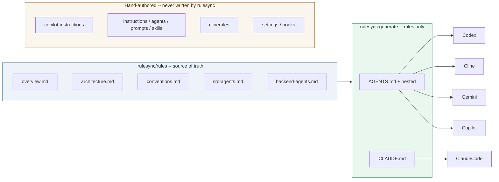

# RuleSync For Unified Agent Instructions

**Status**: Proposed change
**Scope**: Introduce the open-source `rulesync` CLI to generate the shared cross-agent instruction layer from one source of truth, without touching agent-specific instruction files.
**Goal**: Stop `AGENTS.md`, `CLAUDE.md`, and `GEMINI.md` from drifting apart while keeping Copilot-, Cline-, Claude Code-, and Codex-specific configuration hand-authored.

## Summary

We use several AI coding agents (Copilot, Codex, Cline, Claude Code, Gemini) and keep instructions for them in separate files. `CLAUDE.md` and `GEMINI.md` are currently symlinks to `AGENTS.md` — a lightweight single-source approach that avoids copy drift but stays fragile (Windows checkouts, symlink-following) and leaves no generation or drift-check tooling.

Use the open-source `rulesync` CLI (`dyoshikawa/rulesync`) as the generator for only the shared, tool-agnostic rules layer: one `.rulesync/rules/` tree produces `AGENTS.md` (plus nested per-subtree files) and `CLAUDE.md`. Every agent that already reads `AGENTS.md` — Codex, Cline, Gemini, Copilot — stays in sync automatically. Agent-specific capability surfaces stay exactly where they are today, hand-authored and never written by `rulesync`.

## Problem

Agent instructions live in many files that overlap:

- `AGENTS.md` (root plus nested `src/`, `backend/`, `frontend/`, `ingesters/`, `docs/`, `tests/`) is the primary always-on shared guide.
- `CLAUDE.md` and `GEMINI.md` are symlinks to `AGENTS.md`. That avoids copy drift, but it is fragile: a Windows checkout (git `core.symlinks=false`) materializes them as plain text files containing `AGENTS.md`, and tools that do not follow symlinks silently see nothing.
- `GEMINI.md` is redundant: Gemini reads `AGENTS.md` first (discovery order `AGENTS.md` → `CONTEXT.md` → `GEMINI.md`).
- `.clinerules/project.md` points Cline at `.github/copilot-instructions.md`, coupling Cline to a Copilot-named file.

There is no single modular source for the shared rules, and nothing detects when a generated layout, a broken symlink, or a hand-edited copy diverges from `AGENTS.md`.

## Scope

- Adopt `rulesync` as the generator for the shared rules layer (`AGENTS.md` tree and `CLAUDE.md`).
- Migrate the shared content of today's `AGENTS.md` into `.rulesync/rules/`.
- Add `make rules-sync` plus a pre-commit/CI drift check so instructions cannot silently diverge.
- Keep `GEMINI.md` removal or pointer treatment as part of the change.

## Non-Goals

- Generating `mcp`, `hooks`, `permissions`, `subagents`, `commands`, or `skills` with `rulesync`. Those are agent-specific and stay hand-authored.
- Regenerating Copilot's scoped instruction files (`.github/copilot-instructions.md`, `.github/instructions/*.instructions.md`, `.github/agents/`, `.github/prompts/`, `.github/skills/`). They are Copilot-specific and stay hand-authored.
- Migrating any agent-specific file content into `.rulesync/` unless it is genuinely cross-agent.
- Adopting the rulesync.dev SaaS; this proposal is about the open-source CLI only.

## Current Behavior

- `AGENTS.md` is read natively by Codex, Cline, Gemini, Copilot, and Copilot CLI. `CLAUDE.md` is read by Claude Code.
- `CLAUDE.md` and `GEMINI.md` are symlinks to `AGENTS.md`; Claude Code documents the symlinked `CLAUDE.md` as a supported pattern.
- Agent-specific layers are hand-authored: Copilot (`applyTo`-scoped instructions, custom agents, prompts, skills), Cline (`.clinerules/`), Claude Code (`.claude/settings.json` hooks), Codex (`.codex/hooks.json`, `.codex/skills/`).

## Proposed Design

### Layered ownership

Keep two layers with a clear boundary:

1. **Shared rules layer** — owned by `rulesync`, sourced from `.rulesync/rules/*.md`.
2. **Agent-specific capability layer** — hand-authored, never written by `rulesync`.

Because Codex, Cline, Gemini, and Copilot already read `AGENTS.md`, `rulesync` only needs to generate two outputs: `AGENTS.md` (target `agentsmd`, including nested subtree files via `subprojectPath`) and `CLAUDE.md` (target `claudecode`). No other target is enabled, so no agent-specific file is ever overwritten.



### Configuration

```jsonc
// rulesync.jsonc
{
  "$schema": "https://github.com/dyoshikawa/rulesync/releases/latest/download/config-schema.json",
  "targets": ["agentsmd", "claudecode"],
  "features": ["rules"]
}
```

### Source layout

Split today's `AGENTS.md` content into themed rule files under `.rulesync/rules/`, one per area (overview, architecture, cross-cutting, identity, conventions, workflows, vocabulary, graphify, rtk), plus one file per subtree using `agentsmd.subprojectPath` (for example `src-agents.md` → `src/AGENTS.md`). `rulesync import --targets agentsmd` can seed this tree from the existing root and nested `AGENTS.md` files, deriving `subprojectPath` automatically.

### What happens to each agent file

| File | After change |
|---|---|
| `AGENTS.md` + nested | Generated by `agentsmd` from `.rulesync/rules/` |
| `CLAUDE.md` | Generated by `claudecode` (replaces the symlink with a real file, removing symlink-following dependence) |
| `GEMINI.md` | Removed; redundant symlink — Gemini reads `AGENTS.md` first (`AGENTS.md` → `CONTEXT.md` → `GEMINI.md`) |
| `.github/copilot-instructions.md`, `.github/instructions/`, `.github/agents/`, `.github/prompts/`, `.github/skills/` | Hand-authored, untouched |
| `.clinerules/project.md` | Updated to point at `AGENTS.md` instead of the Copilot-named file |
| `.claude/settings.json`, `.codex/hooks.json`, `.codex/skills/` | Hand-authored, untouched |

Generated `AGENTS.md` and `CLAUDE.md` are committed so output is reviewed and diffable; do not run `rulesync gitignore` for these targets.

## Alternatives Considered

- **Symlinks (current state)**: `CLAUDE.md` and `GEMINI.md` link to `AGENTS.md`. Zero duplication and officially supported by Claude Code, but fragile across Windows checkouts and adds nothing for generation, scoping, or drift detection. Kept as the baseline; the proposal replaces the symlink with a generated `CLAUDE.md` and drops the redundant `GEMINI.md`.
- **Pointer files only** (`CLAUDE.md` using `@AGENTS.md` import, `GEMINI.md` as a pointer). Cheaper but no generation tooling and no drift check; editing still happens in multiple places.
- **Full adoption** (`rulesync generate --targets "*" --features "*"`). Would let `rulesync` own Copilot's scoped instructions, `.clinerules`, hooks, and permissions — degrading or flattening the agent-specific targeting we have built. Rejected.
- **rulesync.dev SaaS**. Solves cross-repo/machine sync, not multi-agent instruction generation. Not needed.

## Risks And Tradeoffs

- Generated files become owned by `rulesync`; hand-edits to `AGENTS.md`/`CLAUDE.md` are overwritten. Editors must change `.rulesync/rules/` instead.
- The one-time migration produces a large diff; review it with `--dry-run` before committing.
- `rulesync` is actively developed; its output format may shift on upgrades. Pin the version or review regenerations.
- Multiple targets writing the same `AGENTS.md` path would conflict (last target wins). Keeping only `agentsmd` as the writer avoids this.

## Testing And Validation

- `rulesync generate --dry-run` produces no unexpected diff after an edit to `.rulesync/rules/`.
- `make rules-sync-check` (`rulesync generate --dry-run` plus `git diff --exit-code`) passes in CI and as a pre-commit hook.
- Spot-check that each agent reads the expected file: Codex/Cline/Gemini/Copilot on `AGENTS.md`, Claude Code on `CLAUDE.md`, and that the agent-specific layers (Copilot scoped instructions, `.clinerules`, hooks) are unchanged.

## Acceptance Criteria

- `AGENTS.md`, nested subtree `AGENTS.md` files, and `CLAUDE.md` are generated from `.rulesync/rules/` with no hand-edit residue.
- `GEMINI.md` no longer duplicates `AGENTS.md`.
- No agent-specific file (`.github/instructions/`, `.github/agents/`, `.github/prompts/`, `.github/skills/`, `.clinerules/`, `.claude/settings.json`, `.codex/hooks.json`) is modified by `rulesync`.
- A change to `.rulesync/rules/` followed by `make rules-sync` updates all generated files consistently.
- CI/pre-commit fails when generated files drift from the source.

## Recommended Delivery Order

1. Install `rulesync` and run `rulesync import --targets agentsmd` (and `claudecode`) to seed `.rulesync/rules/`.
2. Reorganize imported files into the themed layout; review the content move.
3. Add `rulesync.jsonc` with `targets: ["agentsmd", "claudecode"]`, `features: ["rules"]`.
4. Generate with `--dry-run`, review the diff, then commit generated `AGENTS.md`/`CLAUDE.md`.
5. Remove `GEMINI.md`; update `.clinerules/project.md` to reference `AGENTS.md`.
6. Add `make rules-sync` and `make rules-sync-check`; wire into pre-commit and CI.

## Open Questions

- Is Gemini CLI actually in use, or is `GEMINI.md` already stale? (Confirms whether removal is safe.)
- Commit generated `AGENTS.md`/`CLAUDE.md` (recommended, for reviewability) or gitignore and require local generation?

## Final Recommendation

Adopt `rulesync` narrowly: generate only the shared rules layer (`AGENTS.md` tree and `CLAUDE.md`) from `.rulesync/rules/`, keep every agent-specific instruction surface hand-authored, and enforce drift with `make rules-sync-check` in pre-commit and CI. This removes the duplication and stops divergence without degrading any agent's targeted instructions.
