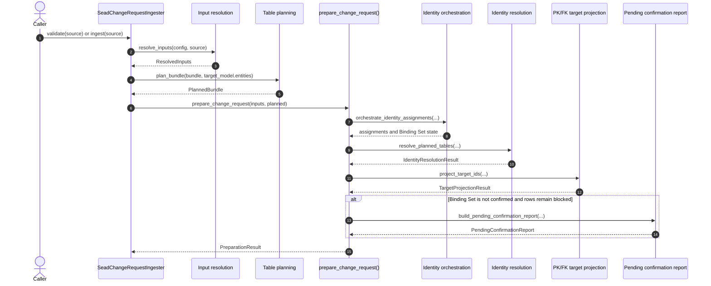
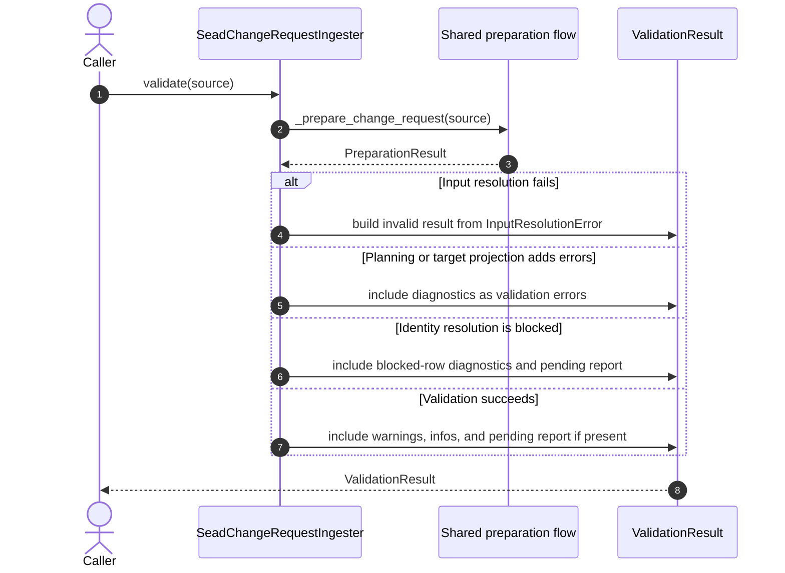
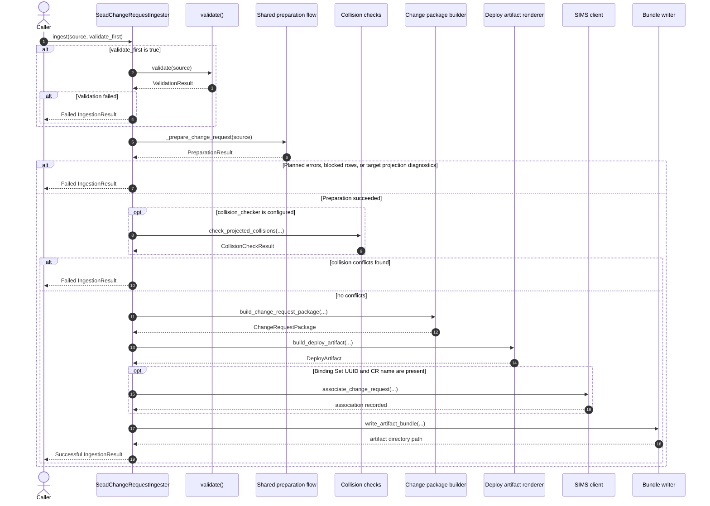

# SEAD Change Request Diagrams

This document gives a high-level view of the core runtime flow in the `sead_change_request` ingester.

The diagrams follow the current implementation in `ingester.py` and `preparation.py`:

- `validate()` and `ingest()` both reuse the same preparation path
- the preparation path stops after identity resolution and PK/FK target projection
- `ingest()` continues with collision checks, package assembly, artifact rendering, and bundle emission

## Shared Preparation Flow

This sequence shows the common path reused by both `validate()` and `ingest()`.

## Validate Flow

This sequence shows how `validate()` turns the shared preparation result into a `ValidationResult`.

## Ingest Flow

This sequence shows the full ingestion path after validation has passed.

