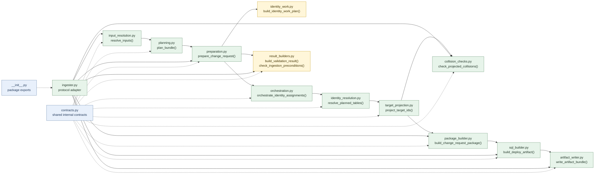

# SEAD Change Request Ingester

This package implements the `sead_change_request` ingester for Shape Shifter.

Its job is to take normalized submission tables, validate them against a target model, resolve the identity work needed for SEAD change requests, and emit a deploy artifact bundle that can be reviewed and executed outside Shape Shifter.

## Overview

This ingester produces deployable change-request artifacts rather than loading rows directly into the live SEAD database.

It does not load rows directly into a live SEAD database. Instead, it prepares a change package and renders that package as a bundle containing deploy SQL, placeholder revert and verify SQL, a manifest, and any payload sidecar files required by the selected deploy strategy.

The package currently supports two main entry points defined by the Shape Shifter ingester protocol:

- `validate()` checks the source bundle, target model, submission context, identity workflow, and target-projection path without emitting a final bundle
- `ingest()` runs the same preparation path, then performs collision checks, builds the change package, renders a deploy artifact, and writes the bundle to the configured output folder

## Pipeline

The implementation follows this high-level flow:

```text
load source tables or an Excel workbook
  -> normalize and validate the inputs
  -> plan each table against the target model
  -> orchestrate identity work via injected clients
  -> project PK/FK values
  -> run optional collision checks
  -> assemble the change package
  -> render the deploy artifact
  -> emit the artifact bundle
```

The shared workflow up to target projection lives in `prepare_change_request()` in [preparation.py](./preparation.py).
Helper result shaping for `validate()` and `ingest()` lives in [result_builders.py](./result_builders.py).

## Module Dependencies

At a package level, the dependency shape is intentionally simple:

- [contracts.py](./contracts.py) is the shared internal type layer used by most modules
- [ingester.py](./ingester.py) is the protocol adapter and top-level runtime entry point
- [preparation.py](./preparation.py) is the shared workflow hub for the reusable middle of the pipeline
- [__init__.py](./__init__.py) is the package export surface rather than a runtime workflow step

This diagram shows the main workflow-oriented module dependencies without drawing every shared-type import from [contracts.py](./contracts.py):



## Key Concepts

### Resolved Inputs

The public ingester protocol still accepts file paths and `IngesterConfig` values.

Inside the package, those inputs are normalized into stable internal contracts defined in [contracts.py](./contracts.py), including:

- `SourceTableBundle`: normalized input tables plus source-level warnings
- `SubmissionContext`: submission metadata used to build the bundle name and SQL headers
- `PlannedTable`: source table plus planned row actions
- `IdentityAssignment` and `IdentityResolutionResult`: resolved per-row identity state
- `TargetProjectionResult`: output-ready tables with target-facing PK/FK values
- `ChangeRequestPackage`: rows selected for insertion into the final change request
- `DeployArtifact`: rendered SQL plus bundle metadata and sidecar files

### Preparation Workflow

`prepare_change_request()` exists to keep the shared workflow out of the protocol adapter.

It prepares:

- resolved inputs
- per-table planning output
- identity orchestration output
- resolved identity tables
- projected tables
- a pending confirmation report when Binding Set confirmation blocks generation

The main ingester still owns protocol-facing concerns such as converting failures into `ValidationResult` or `IngestionResult`, running collision checks, rendering deploy artifacts, and writing files to disk.

### Deploy Strategies

Deploy rendering is separated behind a strategy boundary in [sql_builder.py](./sql_builder.py).

Current strategies:

- `inline_insert`: renders inline `INSERT` statements into the deploy SQL
- `copy_csv`: renders payload sidecar files plus `\copy`-based deploy SQL

The ingester resolves the requested strategy from `IngesterConfig.extra["deploy_strategy"]` and passes it into artifact rendering.

## Module Map By Workflow Step

### Foundation And Package Surface

- [contracts.py](./contracts.py): shared internal data structures, enums, bundle naming helpers, and the `PendingConfirmationReport` contract
- [__init__.py](./__init__.py): public package export surface for the main ingester-facing types and helper functions

### Step 1: Resolve Inputs

- [input_resolution.py](./input_resolution.py): loads Excel or in-memory tables, validates ingester config inputs, resolves the target model, submission context, fallback identity assignments, and deploy strategy

### Step 2: Plan Work

- [planning.py](./planning.py): plans per-row actions for each source table and assembles `PlannedBundle`
- [identity_work.py](./identity_work.py): groups planned rows into existing, allocation, reconciliation, and bridge work queues

### Step 3: Run The Shared Preparation Path

- [preparation.py](./preparation.py): shared workflow hub used by both `validate()` and `ingest()`
- [orchestration.py](./orchestration.py): thin orchestration over injected SIMS and reconciliation clients
- [identity_resolution.py](./identity_resolution.py): applies identity assignments back onto planned tables
- [target_projection.py](./target_projection.py): rewrites local working IDs into target-facing PK/FK values

### Step 4: Shape Validation And Precondition Results

- [result_builders.py](./result_builders.py): converts preparation output into `ValidationResult` or precondition failures for `IngestionResult`

### Step 5: Finish The Ingestion-Only Path

- [collision_checks.py](./collision_checks.py): optional target-side collision checks before package generation
- [package_builder.py](./package_builder.py): selects insertable rows and builds the in-memory change package
- [sql_builder.py](./sql_builder.py): renders deploy artifacts and strategy-specific payload metadata
- [artifact_writer.py](./artifact_writer.py): writes deploy, revert, verify, manifest, and payload files to disk

### Runtime Entry Point

- [ingester.py](./ingester.py): protocol adapter that coordinates the workflow, converts expected failures into protocol results, and invokes file emission

### Package Documentation

- [DIAGRAMS.md](./DIAGRAMS.md): sequence diagrams for the shared preparation, validation, and ingest flows

## Configuration And Injected Collaborators

The ingester uses `IngesterConfig.extra` for package-specific settings.

Common inputs include:

- `target_model`: required `TargetModel` or raw target-model payload
- `submission_context`: required submission metadata
- `tables` or `source_bundle`: in-memory input tables when not reading from Excel
- `identity_assignments`: optional fallback row assignments
- `deploy_strategy`: optional deploy renderer name or strategy instance

Optional injected collaborators include:

- `sims_client`: allocates entities, derives bridge rows, and manages Binding Set state
- `reconciliation_client`: resolves classifier-like rows to existing target IDs
- `collision_checker`: checks whether rendered rows would collide with target data

## Artifact Output

The ingester writes a bundle under `IngesterConfig.output_folder` using the canonical bundle name derived from `SubmissionContext`.

The emitted directory contains:

- `deploy/<bundle_name>.sql`
- `revert/<bundle_name>.sql`
- `verify/<bundle_name>.sql`
- `manifest.json`
- any strategy-specific bundle files such as `deploy/<bundle_name>/*.gz`

The exact payload shape depends on the selected deploy strategy.

## Validation Vs Ingestion

`validate()` and `ingest()` intentionally remain separate.

- `validate()` reports input-resolution failures, planning issues, blocked identity work, and projection problems as structured validation output
- `ingest()` can optionally call `validate()` first, then continues into collision checks, package assembly, artifact rendering, and bundle emission

This separation keeps validation side-effect free while allowing ingestion to perform file emission and collaborator callbacks such as change-request association.

## Testing

The main unit and behavior tests for this package live in `backend/tests/ingesters/`.

Useful commands:

```bash
PYTHONPATH=.:backend pytest backend/tests/ingesters/test_sead_change_request_ingester.py -q
PYTHONPATH=.:backend pytest backend/tests/ingesters/test_sead_change_request_sql_builder.py -q
PYTHONPATH=.:backend pytest backend/tests/ingesters -q
```

## Current Scope

The current implementation focuses on preparing and emitting change-request artifacts from normalized Shape Shifter output.

It is designed to keep business rules around planning, identity resolution, target projection, and deploy rendering explicit and testable, while leaving downstream execution of the generated artifacts outside this package.